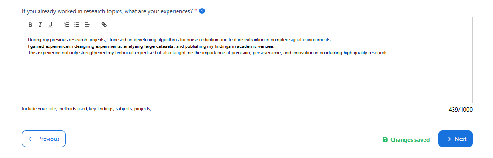
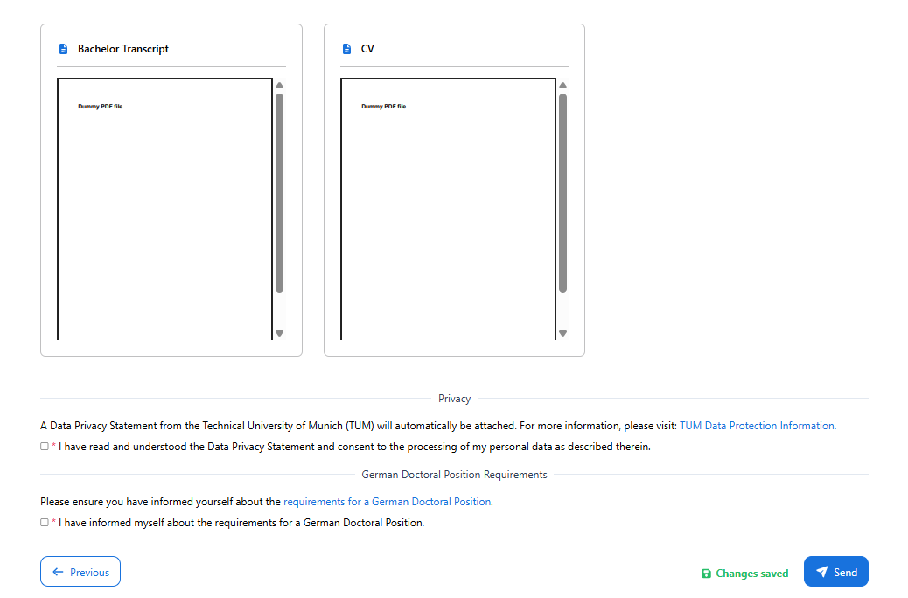
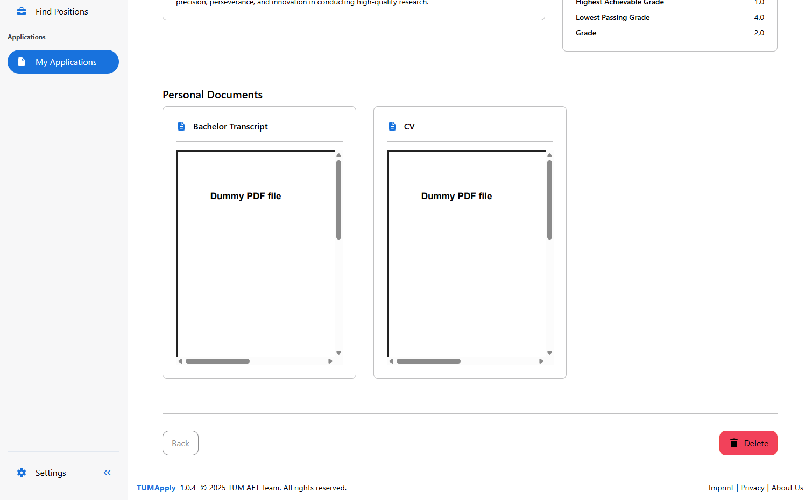

# Application Module (Technical Documentation)

The **Application Module** enables applicants to create, manage, and submit doctoral applications through a structured multi-step workflow. It introduces comprehensive application lifecycle management (creation, editing, submission, withdrawal, deletion), document upload capabilities, and real-time status tracking. All operations are subject to strict authorization checks enforced by security annotations.

---

## Table of Contents

- [Application Management](#application-management)
  - [Server-Side Architecture](#server-side-architecture)
  - [Client-Side Architecture](#client-side-architecture)
- [Domain Model](#domain-model)
  - [Core Entities](#core-entities)
  - [Data Transfer Objects](#data-transfer-objects)
- [Key Workflows](#key-workflows)
  - [Quick Reference](#quick-reference)
  - [Application Creation Workflow](#application-creation-workflow)
  - [Application Update Workflow](#application-update-workflow)
  - [Application Submission Workflow](#application-submission-workflow)
  - [Application Withdrawal Workflow](#application-withdrawal-workflow)
  - [Document Upload Workflow](#document-upload-workflow)

---

## Application Management

### Server-Side Architecture

**Source Paths:**

- Service: `de/tum/cit/aet/application/service/ApplicationService.java`
- Repository: `de/tum/cit/aet/application/repository/ApplicationRepository.java`
- Repository Impl: `de/tum/cit/aet/application/repository/impl/ApplicationEntityRepositoryImpl.java`
- Resource: `de/tum/cit/aet/application/web/ApplicationResource.java`

**Core Components:**

- `ApplicationService` — orchestrates application lifecycle logic (create, update, submit, withdraw, delete), manages state transitions, coordinates with external modules (Document Module, Job Posting Module), and ensures data consistency through transactional operations.
- `ApplicationRepository` / `ApplicationEntityRepositoryImpl` — provides persistence and query capabilities, including JPQL-based DTO projections, paginated queries using Criteria API, and bulk state update operations.
- `Application` — domain entity storing application metadata (state, timestamps, applicant responses) with relationships to Job, Applicant, and supporting entities ([CustomFieldAnswer](#customfieldanswer), InternalComment).

**Key Behaviors:**

- **Creation flow:**

  - Validates job availability and checks for duplicate applications (same applicant + job).
  - State initialization: `SAVED` (draft state).
  - Creates bidirectional relationships between Application, Applicant, and Job entities.
  - Returns `ApplicationForApplicantDTO` with pre-populated applicant profile data for form initialization.

- **Update flow:**

  - Authorization: Only applicants owning the application (or admins) can update.
  - Allowed states: `SAVED` only (prevents modification of submitted applications).
  - Updates applicant profile data alongside application-specific fields (motivation, skills, projects).
  - Transactional consistency ensures atomic updates across Application and Applicant entities.
  - Returns updated `ApplicationForApplicantDTO` for immediate UI synchronization.

- **Submit flow:**

  - State transition: `SAVED` → `SENT`.
  - Sets `appliedAt` timestamp for audit trail.
  - Prevents further modifications by rejecting updates on non-SAVED applications.
  - Triggers notification workflows (delegated to separate Notification Module).

- **Withdrawal flow:**

  - State transition: `SENT` / `IN_REVIEW` → `WITHDRAWN`.
  - Preserves application data for audit compliance.
  - Updates implemented via bulk update query for efficiency.
  - Triggers stakeholder notifications about withdrawal.

- **Deletion flow:**

  - Allowed only for `SAVED` (draft) applications.
  - Cascade deletion of associated entities: [CustomFieldAnswers](#customfieldanswer), InternalComments, DocumentDictionary references.
  - Actual document files handled by separate Document Module.
  - Returns `204 No Content` on success.

- **Document management:**

  - Delegates file storage to Document Module via `DocumentService`.
  - Maintains `DocumentDictionary` entries linking documents to applications.
  - Supports multiple document types: `CV`, `BACHELOR_TRANSCRIPT`, `MASTER_TRANSCRIPT`, `REFERENCES`.
  - Provides document renaming and deletion capabilities.
  - Returns `DocumentInformationHolderDTO` set after upload operations.

- **Pagination queries:**

  - Implemented using **JPA Criteria API** in `ApplicationEntityRepositoryImpl`.
  - Purpose: efficiently retrieve paginated application overviews with filtering capabilities.
  - Constructs dynamic queries with joins (Application → Job → ResearchGroup).
  - Projects directly to `ApplicationOverviewDTO` to minimize data transfer.
  - Supports sorting by creation date (descending by default).
  - Enables scalable list views without loading entire datasets.

- **Bulk state updates:**

  - Used during job state transitions (`CLOSED`, `APPLICANT_FOUND`).
  - Updates all applications for a job based on conditional logic:
    - `SAVED` → `JOB_CLOSED` (draft applications for closed positions).
    - `SENT` / `IN_REVIEW` → `JOB_CLOSED` when job closes without selection.
    - `SENT` / `IN_REVIEW` → `REJECTED` when position is filled.
  - Implemented via JPQL bulk update with CASE expression for conditional state mapping.

---

### Client-Side Architecture

**Core Components:**

- `ApplicationOverviewForApplicantComponent` (`application-overview-for-applicant.component.ts`)

  - Provides paginated, sortable tabular overview of applicant's applications.
  - Uses signal-based reactive state management for loading states and data.
  - Integrates `DynamicTableComponent` for consistent table rendering.
  - Handles lazy loading via `TableLazyLoadEvent` for performance optimization.
  - Implements action buttons (View, Update, Withdraw, Delete) with conditional visibility based on application state.

- `ApplicationCreationFormComponent` (`application-creation-form.component.ts`)
  - Implements multi-step wizard workflow with four stages:
    1. Personal Information (`application-creation-page1`) 
    2. Education + Document Uploads (`application-creation-page2`) 
    3. Application Details + Document Uploads (`application-creation-page3`)  
    4. Summary + Consent (`application-detail-for-applicant` in preview mode)  
  - Features automatic progress saving with visual feedback (`saving`, `saved`, `error` states).
  - Uses `ProgressStepperComponent` for visual step navigation.
  - Implements bi-directional data flow with child form components.
  - Validates required consents (privacy policy, doctoral requirements) before submission.
  - Provides confirmation dialog before final submission.

- `ApplicationDetailForApplicantComponent` (`application-detail-for-applicant.component.ts`)

  - Renders comprehensive application view with dual modes:
    - **Preview mode**: Used within submission workflow (step 4) with passed-in data.
    - **Standalone mode**: Full detail page with data fetched from backend.
  - Displays structured sections: Position Overview, Personal Statements, Personal Information, Documents.
  - Integrates `DocumentViewerComponent` for inline document preview.
  - Provides state-conditional actions: Update (SAVED), Withdraw (SENT / IN_REVIEW), Delete (SAVED).
  - Uses computed signals for reactive data resolution (preview vs. actual).

**Section Components (used within pages):**

- `ApplicationCreationPage1Component` — Personal information form (name, contact, links).
- `ApplicationCreationPage2Component` — Education data + transcript uploads (Bachelor / Master).
- `ApplicationCreationPage3Component` — Application-specific fields + CV / reference uploads.
- `ApplicationStateForApplicantsComponent` — Displays application state as color-coded badge.
- `DocumentViewerComponent` — Renders document previews with download functionality.
- `UploadButtonComponent` — Handles file uploads with validation and progress tracking.
- `ConfirmDialog` — Modal confirmation for destructive actions (delete, withdraw, submit).
- `DynamicTableComponent` — Reusable table with pagination, sorting, custom templates.
- `ProgressStepperComponent` — Visual step indicator for multi-step workflows.

**Behavior:**

- **Multi-step form workflow:**
  - Progressive disclosure pattern reduces cognitive load.
  - Each step validates independently before allowing progression.
  - Data persists across steps via parent component signals.
  - Summary step provides complete preview before submission.

- **Auto-save functionality:**
  - Triggered on every value change with 500ms debounce.
  - Visual feedback via badge: "Saving..." → "Saved" → "Error".
  - Handles concurrent saves via sequential promise chaining.
  - Graceful error handling with user notification.

- **Conditional action rendering:**
  - Action buttons visibility controlled by application state:
    - `SAVED`: Update, Delete
    - `SENT` / `IN_REVIEW`: View, Withdraw
    - Other states: View only
  - Prevents invalid state transitions through UI constraints.

- **Document integration:**
  - Upload handlers pass `applicationId` and `documentType` to child components.
  - Document IDs fetched separately for efficient rendering.
  - Supports multiple documents per type (transcripts, references).
  - Preview mode displays documents without edit capabilities.

---

## Domain Model

### Core Entities

**Application:**
- Central aggregator for all application-related data.
- Tracks state transitions through `ApplicationState` enum.
- Maintains relationships to:
  - `Applicant` (ManyToOne) — Owner of the application.
  - `Job` (ManyToOne) — Position being applied for.
  - `ApplicationReview` (OneToOne) — Evaluation decision (managed by Evaluation Module).
  - `CustomFieldAnswer` (OneToMany) — Job-specific question responses.
  - `InternalComment` (OneToMany) — Professor comments (managed by Evaluation Module).
- Timestamps: `createdAt`, `lastModifiedAt` (via `AbstractAuditingEntity`), `appliedAt`.
- Application-specific fields: `desiredStartDate`, `projects`, `specialSkills`, `motivation`.

**Applicant:**
- Extends User entity via OneToOne relationship with shared primary key.
- Stores applicant-specific profile data:
  - Address: `street`, `postalCode`, `city`, `country`.
  - Bachelor's degree: `bachelorDegreeName`, `bachelorUniversity`, grade fields.
  - Master's degree: `masterDegreeName`, `masterUniversity`, grade fields.
- Contains collection of `submittedApplications` (OneToMany to Application).
- Enables profile reuse across multiple applications.

**User:**
- Shared entity supporting multiple roles (Applicant, Professor).
- Core fields: `userId` (UUID), `email`, `firstName`, `lastName`, authentication data.
- Optional fields: `gender`, `nationality`, `birthday`, `phoneNumber`, contact URLs.
- References: `researchGroup` (for professors), `postedJobs` (OneToMany).
- Supports late initialization: Applicant profile created on first application creation.

**Document / DocumentDictionary:**
- **Document**: Stores actual file metadata (`path`, `mimeType`, `sizeBytes`, `sha256Id` for deduplication).

- **DocumentDictionary**: Junction entity linking documents to applications / applicants.
  - Flexible associations: Can link to `application`, `applicant`, or `customFieldAnswer`.
  - Stores `documentType` enum and user-defined `name`.
  - Enables document reuse across multiple applications.
- Managed by separate Document Module; Application Module maintains references only.

**ApplicationState Enum:**
- `SAVED` — Draft application, editable by applicant.
- `SENT` — Submitted, under initial review.
- `IN_REVIEW` — Actively being evaluated by professors.
- `ACCEPTED` — Offer extended (managed by Evaluation Module).
- `REJECTED` — Application declined (managed by Evaluation Module).
- `WITHDRAWN` — Applicant withdrew application.
- `JOB_CLOSED` — Position closed before evaluation completed.
