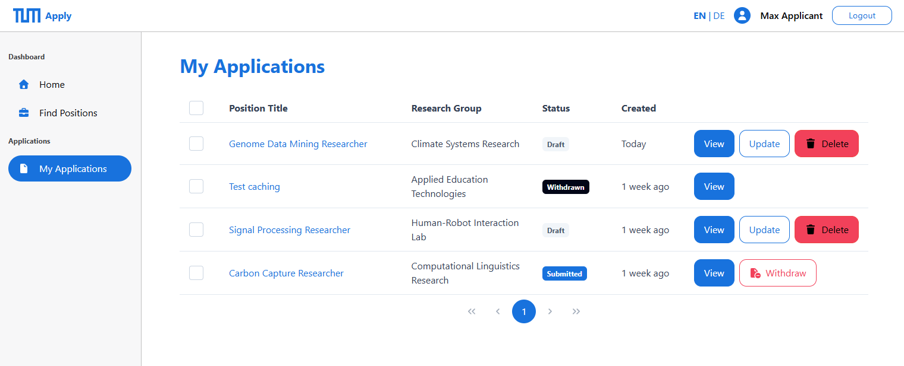
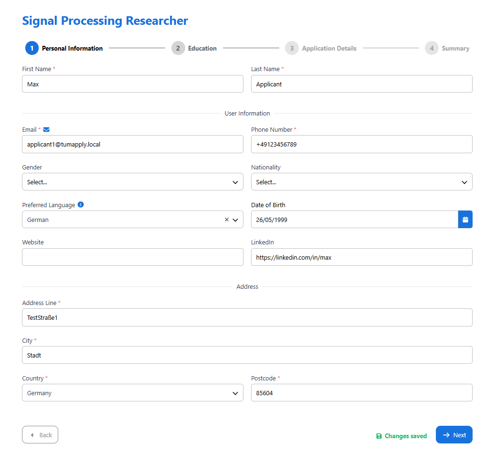
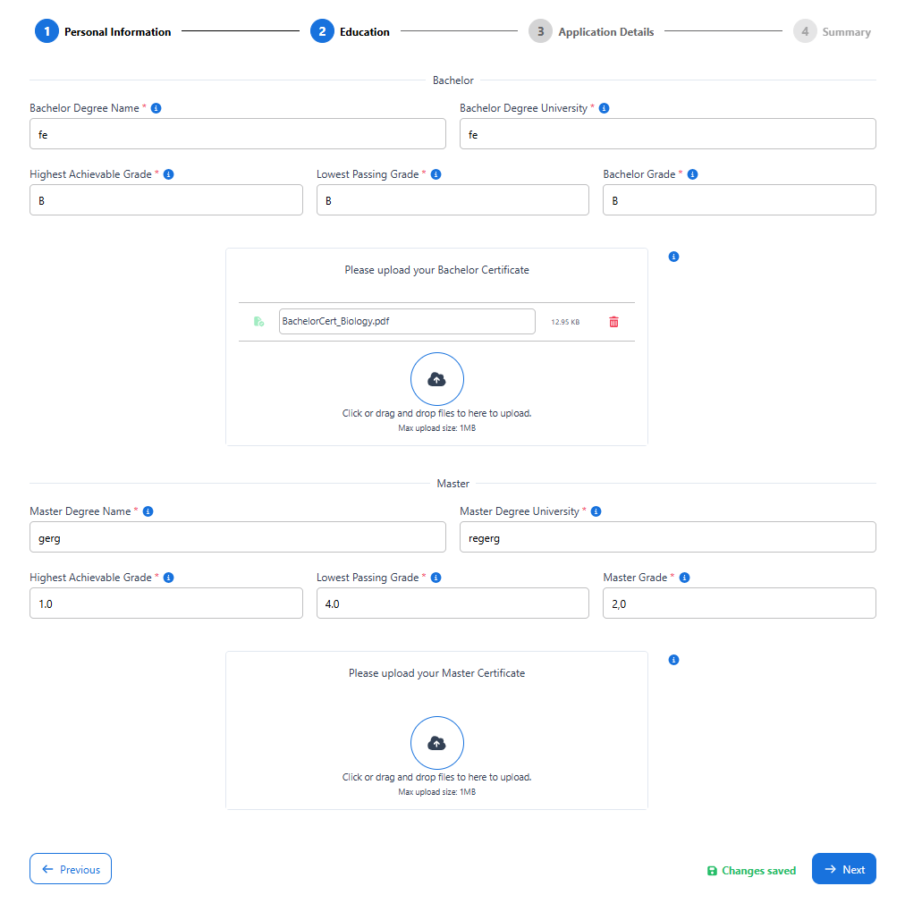
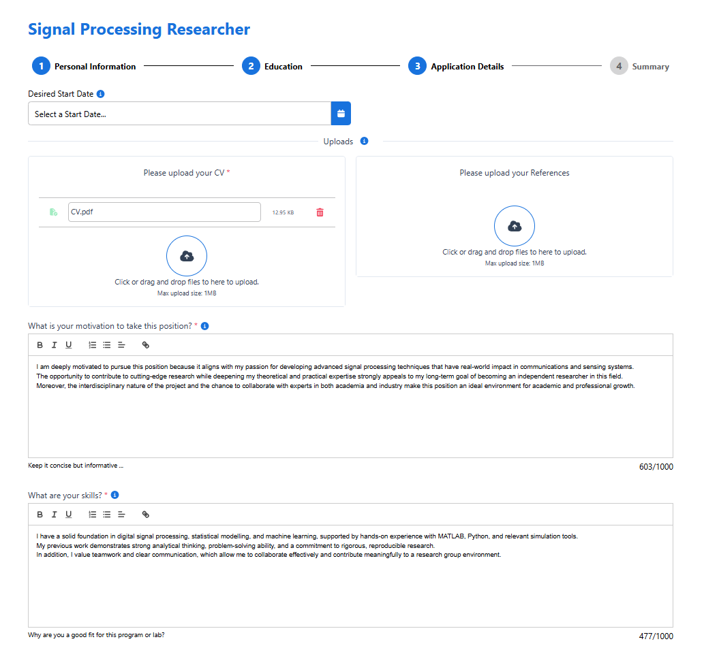
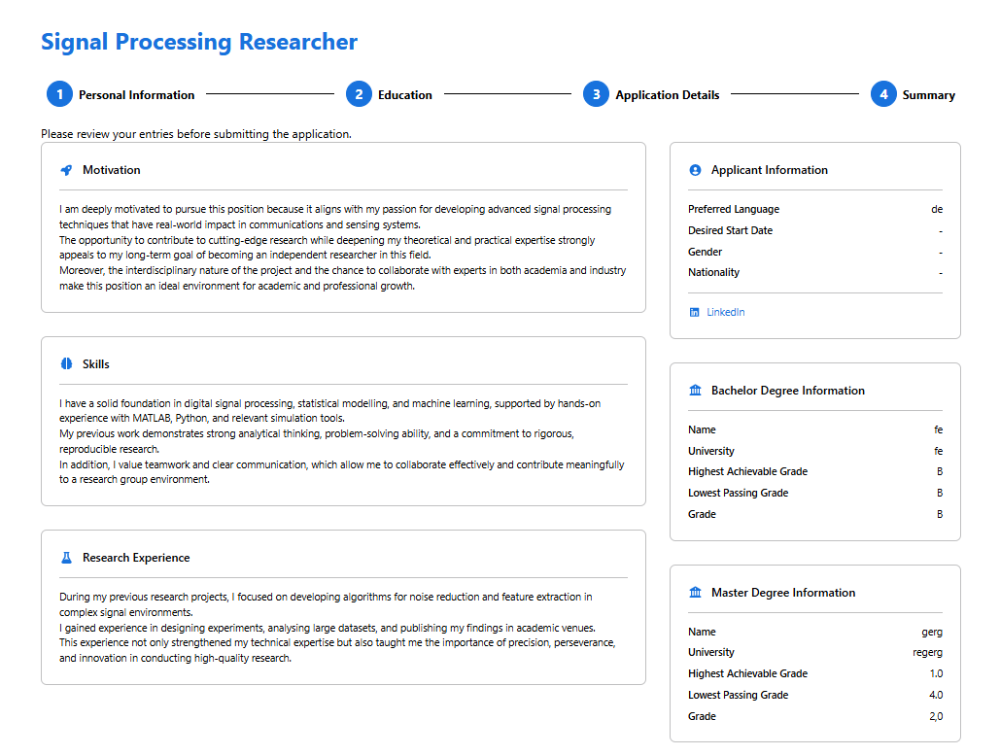
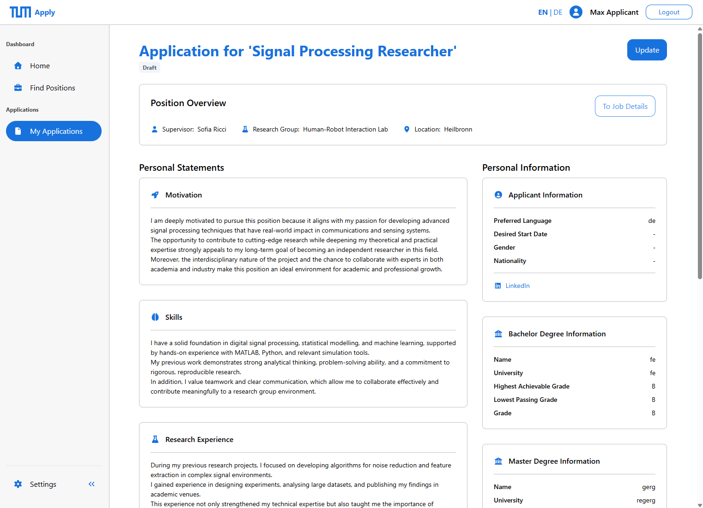

# Application Module (Technical Documentation)

The **Application Module** enables applicants to create, manage, and submit doctoral applications through a multi-step workflow. It provides lifecycle management (creation, editing, submission, withdrawal, deletion), document uploads, and status tracking.

---

## Server-Side Architecture

**Core Components:**

* `ApplicationService` - orchestrates lifecycle logic, manages state transitions, coordinates with Document and Job modules.
* `ApplicationRepository` / `ApplicationEntityRepositoryImpl` - persistence with DTO projections, paginated queries (Criteria API), bulk state updates.
* `Application` - domain entity with relationships to Job, Applicant and InternalComment

**Key Behaviors:**

The `ApplicationState` is marked like this in the following section:

* **Creation:** Validates job availability, checks duplicates, initializes as `SAVED`, returns pre-populated DTO.
* **Update:** Authorization check, allowed only for `SAVED` state, transactional updates.
* **Submit:** `SAVED` → `SENT`, sets 'appliedAt' timestamp, prevents further edits.
* **Withdraw:** `SENT`/`IN_REVIEW` → `WITHDRAWN`, preserves data for audit.
* **Delete:** Only for `SAVED` applications, cascade deletes associated entities.
* **Documents:** Delegates to Document Module, supports multiple types (CV, transcripts, references)
* **Pagination:** Criteria API with direct DTO projection for efficiency
* **Bulk updates:** JPQL bulk update during job state transitions

**Source Paths:**

* Service: `de/tum/cit/aet/application/service/ApplicationService.java`
* Repository: `de/tum/cit/aet/application/repository/ApplicationRepository.java`
* Repository Impl: `de/tum/cit/aet/application/repository/impl/ApplicationEntityRepositoryImpl.java`
* Resource: `de/tum/cit/aet/application/web/ApplicationResource.java`

---

## Client-Side Architecture

**Core Components:**

* `ApplicationOverviewForApplicantComponent`

  * Paginated table of applications using `DynamicTableComponent`
  * Signal-based state management
  * Conditional action buttons based on application state

* `ApplicationCreationFormComponent`
  * Multi-step wizard (4 stages): Personal Info → Education (+ Document upload) → Application (+ Document upload) → Summary (+ Consent)
   
   
   
  
  * Auto-save with 500ms debounce, visual feedback (`saving`, `saved`, `error`)
  * Uses `ProgressStepperComponent` for navigation

* `ApplicationDetailForApplicantComponent`

  * Dual modes: Preview (in-workflow) and Standalone (fetched data)
  * Sections: Position Overview, Personal Statements, Personal Info, Documents
  * State-conditional actions: Update (`SAVED`), Withdraw (`SENT`/`IN_REVIEW`), Delete (`SAVED`)

**Helper Components:**

* `ApplicationCreationPage1/2/3Component` - Form sections for multi-step workflow
* `ApplicationStateForApplicantsComponent` - Color-coded state badge
* `DocumentViewerComponent` - Document preview component
* `UploadButtonComponent` - File upload with validation

**Behavior:**

* Progressive disclosure pattern reduces cognitive load.
* Auto-save on changes prevents data loss.
* Action visibility controlled by application state.
* Document uploads linked automatically to application.

---

## Domain Model

**Application:**
* State transitions via `ApplicationState` enum.
* Relationships: Applicant, Job, ApplicationReview, CustomFieldAnswer, InternalComment.
* Fields: `desiredStartDate`, `projects`, `specialSkills`, `motivation`.

**Applicant:**
* OneToOne with User (shared primary key).
* Stores profile data (address, bachelor/master degrees).
* Enables profile reuse across applications.

**ApplicationState:**
* `SAVED` - Draft, editable.
* `SENT` - Submitted, under review.
* `IN_REVIEW` - Being evaluated.
* `ACCEPTED`/`REJECTED` - Final decisions (Evaluation Module).
* `WITHDRAWN` - Applicant withdrew.
* `JOB_CLOSED` - Position closed.

**DTOs:**
* `ApplicationForApplicantDTO` - Full data for create/update/detail.
* `ApplicationOverviewDTO` - Lightweight for list views.
* `DocumentInformationHolderDTO` - Document reference (id, size).

---

## Key Workflows

The `ApplicationState` is marked like this in the following section.

### Creation
1. User clicks "Apply" on job detail
2. System checks duplicates, creates `SAVED` application
3. Redirects to 4-step form
4. Auto-save on changes (500ms debounce)
5. Step 4: Preview + consent checkboxes
6. Submit → set to `SENT`, notification sent

### Update
1. Open `SAVED` application, click "Update"
2. Form pre-populated with existing data
3. Auto-save on changes
4. Exit returns to detail view

### Submission
1. Complete all steps + consents
2. Confirmation dialog
3. Backend: `SAVED` → set to `SENT`
4. Notification to professor

### Withdrawal
1. Open `SENT`/`IN_REVIEW` application
2. Click "Withdraw", confirm
3. Backend: → set to `WITHDRAWN`
4. Notification to professor

### Document Upload
1. Click upload button (per document type)
2. Client validates file
3. Upload to Document Module
4. Returns document ID
5. Links to application automatically
