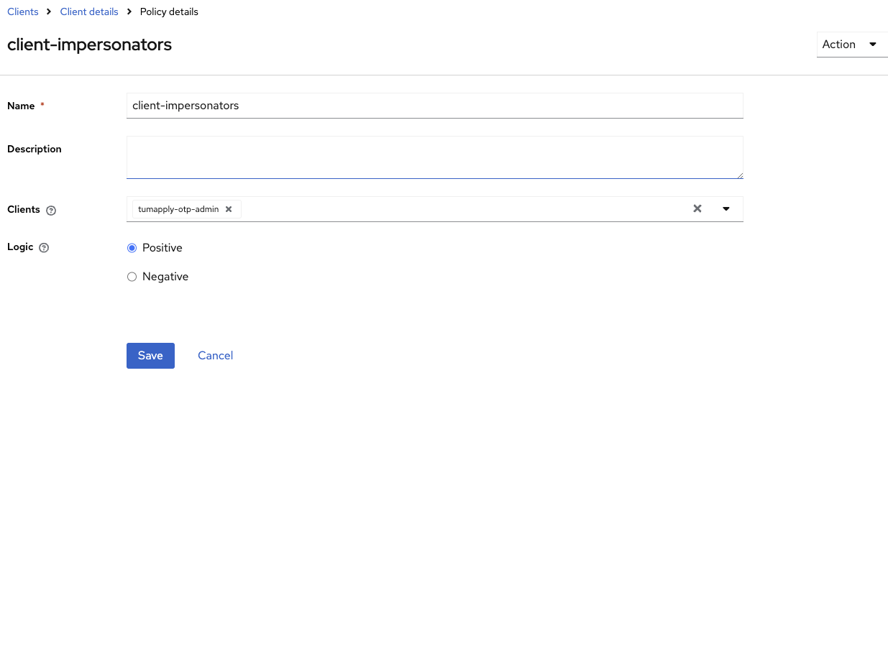

# 🧑‍💼 Impersonation Setup

Impersonation allows administrators to **log in as another user**.

---

## Impersonation and Token Exchange Flow in TUMApply

In TUMApply, impersonation is used when the server receives a user's email and verified OTP but needs to obtain a valid
Keycloak access token on behalf of that user. This process allows seamless authentication without exposing the Keycloak
UI to the user.

The flow proceeds as follows:

1. The user submits their email and OTP to the TUMApply server.
2. The server verifies the OTP against its database.
3. After verification, the server calls the Keycloak `/protocol/openid-connect/token` endpoint using the
   `tumapply-otp-admin` client credentials.
4. The request uses `grant_type=urn:ietf:params:oauth:grant-type:token-exchange`, the clientId as audience and includes
   the `requested_subject` parameter, which is the user ID or username of the user to be impersonated.
5. Keycloak returns a valid access token and refresh token for the impersonated user.
6. The server returns this token to the client, allowing the user to proceed seamlessly without any Keycloak UI
   interaction.

This approach requires enabling the `token-exchange` and `admin-fine-grained-authz:v1` features in Keycloak. Newer
versions of Keycloak (post-26.3.1) have deprecated full impersonation support without legacy token exchange enabled.

---

## Manual Steps to Enable Impersonation

To manually enable impersonation in Keycloak for TUMApply, follow these steps:

**⚠️ Warning: The UI and texts can differ between versions. This is the approach for version 26.3.1.**

1. **Enable Required Features**:  
   Start Keycloak with the following features enabled:

   ```
   --features=token-exchange,admin-fine-grained-authz:v1
   ```

   (Add this to your Docker command or Keycloak startup configuration.)

2. **Enable User Permissions**:

- In the Keycloak Admin Console, go to **Users**.
- Navigate to the **Permissions** tab.
- Click **Enable Permissions**.

3. **Add Impersonation Permission**:

- In the same **Permissions** section, click on **user-impersonated**.

4. **Configure Authorization in realm-management Client**:

- Go to **Clients → realm-management → Authorization**.
- Add or verify the necessary resources, policies, and scope-based permissions as shown in the pictures below.

**Resources:**


**Permissions:**


**Policy:**


5. **Test the Impersonation Flow**:

- Use the `/protocol/openid-connect/token` endpoint with the
  `grant_type=urn:ietf:params:oauth:grant-type:token-exchange` and the `requested_subject` parameter to verify that
  impersonation works as expected.

### References

- [Token Exchange](https://www.keycloak.org/securing-apps/token-exchange#_granting_permission_for_the_exchange_3)
- [Legacy Token Exchange](https://www.keycloak.org/docs/26.3.4/upgrading/#supported-standard-token-exchange)

---

## Version Compatibility Notice

Impersonation currently only works correctly in Keycloak **v26.3.1** or earlier, because version 26.2.0 and higher have
changed the client role and authorization model. The current configuration enables the `token-exchange` and
`admin-fine-grained-authz:v1` features to maintain impersonation functionality. Once Keycloak officially reintroduces
support for impersonation, this setup can be updated accordingly. For the latest details, refer to the official
documentation: https://www.keycloak.org/docs/latest/release_notes/index.html#supported-standard-token-exchange.

---

## Security Notes

- Restrict impersonation to admins
- Monitor impersonation events in Keycloak logs
- Never use impersonation accounts in automated tests or CI

---

## Troubleshooting

- Ensure you are using Keycloak version **v26.3.1** or earlier for reliable impersonation support.
- Verify that the `token-exchange` and `admin-fine-grained-authz:v1` features are active.

---

## Technical Summary

This impersonation setup uses the older fine-grained authorization model intentionally for compatibility with Keycloak
versions up to v26.3.1. It relies on legacy token exchange features to enable impersonation functionality that newer
Keycloak versions have changed or deprecated. It is recommended to migrate this configuration once Keycloak fully
supports impersonation under the new authorization and client roles model to ensure future compatibility and security
improvements.
