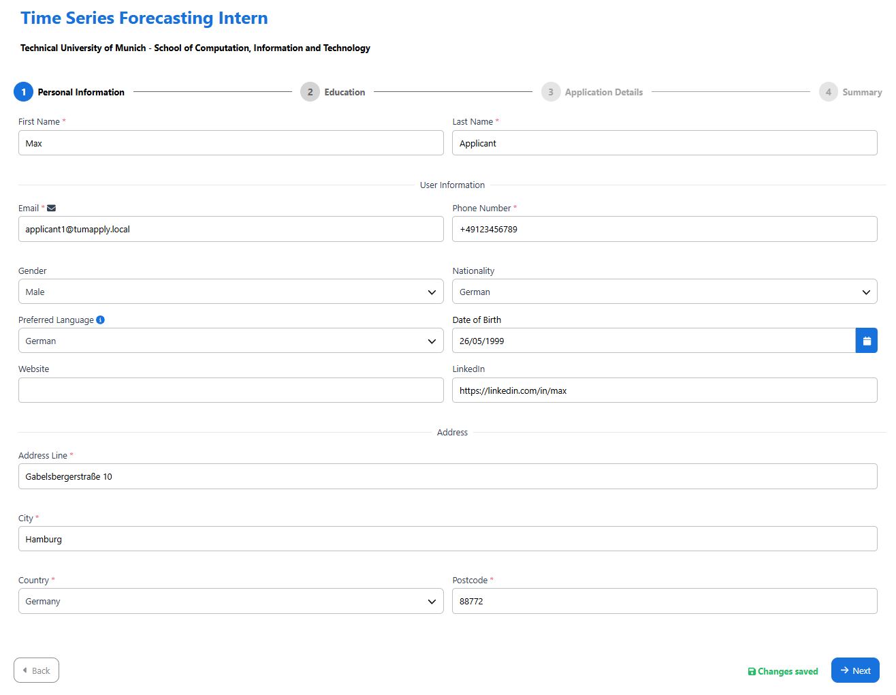
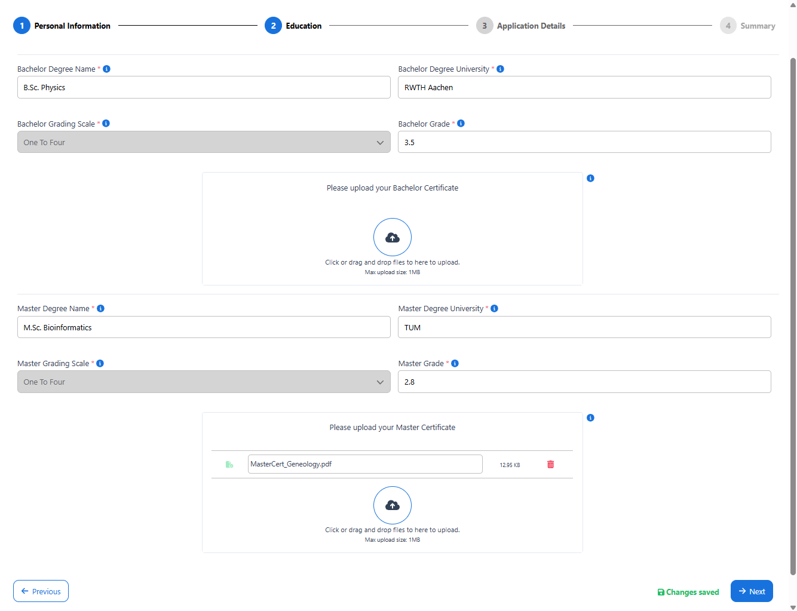
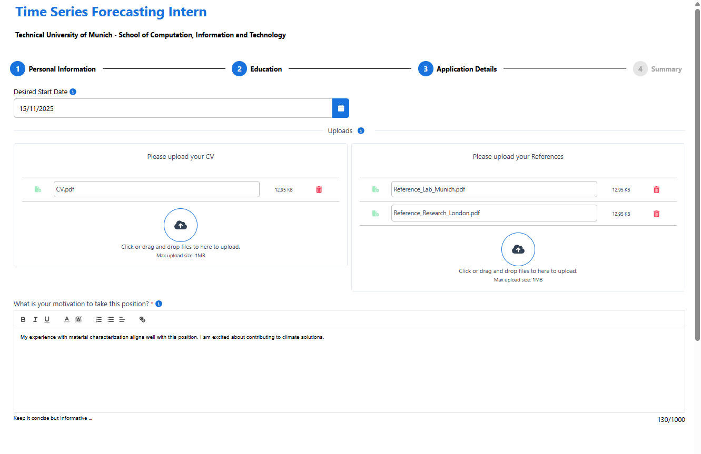
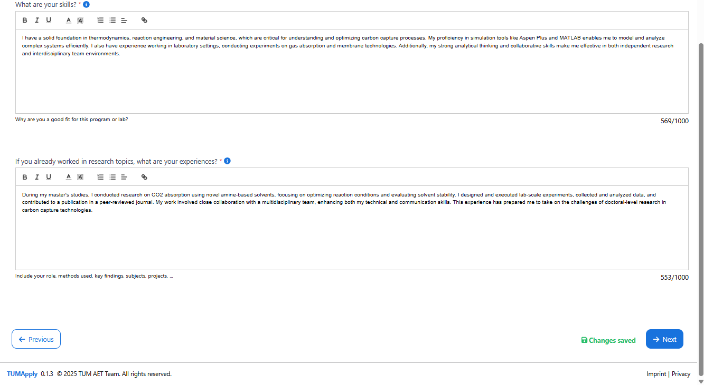

# How to Apply for a Doctoral Position: Step-by-Step Guide

## Getting Started

Welcome to the TUMApply Doctoral Portal application system! This guide will walk you through the complete application process, from finding a position to submitting your materials.

## Step 1: Finding and Selecting a Position

1. **Navigate to Available Positions**
   - Log into the TUMApply Doctoral Portal using your credentials
   - Go to the "Doctoral Applications" section
   - Browse available positions filtered by your academic background and research interests

2. **Select Your Position**
   - Click on a position that matches your qualifications
   - Review the position requirements and supervisor information
   - Click "Apply" to begin your application

## Step 2: Application Creation - Multi-Step Process

The application form is designed as a **4-page wizard** to make the process manageable and ensure you don't lose your progress.

### Page 1: Personal Information
- **Fill in basic details**: Name, email, contact information
- **Academic background**: Current degree status, institution
- **Required fields** are marked with red asterisks (*)
- **Auto-save feature**: Your progress is automatically saved every few seconds
- Click "Next" to proceed (only enabled when all required fields are completed)

### Page 2: Academic Background & Documents
- **University information**: Previous degrees and their grades, institutions attended
- **Upload academic documents**: 
  - Degree certificates (PDF format, max 10MB)
- **Document validation**: The system checks file format and size

### Page 3: Application Questions & Additional Documents
- **Answer position-specific questions**: These vary by supervisor and research area
- **Upload supporting documents**:
  - CV/Resume
  - Reference letters
- **Progress indicator**: Shows completion status of each section

### Page 4: Review & Submit
- **Complete application summary**: Review all entered information
- **Document checklist**: Verify all required documents are uploaded
- **Edit capability**: Click "Back" to modify any section if needed
- **Final validation**: System performs comprehensive check before submission

## Step 3: Submission Options

You have two choices on the final page:

### Option A: Submit Application
- Click **"Submit Application"** for final submission
- **Confirmation dialog** appears asking you to confirm
- Once submitted, you cannot edit the application
- **Automatic notifications** are sent to supervisors
- You'll receive a confirmation email with submission details

### Option B: Save as Draft
- Simply exit the application form
- Application is saved with all current progress
- You can return anytime to continue editing
- Draft applications appear in your "My Applications" dashboard

## Step 4: After Submission

### Immediate Actions
- You're redirected to your **Application Dashboard**
- Submission confirmation is displayed
- Application status changes to "Submitted"

### Ongoing Management
- **Track progress** through the application dashboard
- **Monitor status updates** as supervisors review your application
- **Receive notifications** for status changes via email
- **View detailed application** anytime from your dashboard

## Key Features That Help You

### Auto-Save Protection
- **Automatic saving** every 30 seconds prevents data loss
- **Session persistence** allows you to leave and return
- **Draft recovery** if your browser closes unexpectedly

### Validation System
- **Real-time error checking** shows issues immediately
- **Required field indicators** clearly mark what's needed
- **File format validation** ensures documents upload correctly
- **Progress tracking** shows completion status

### User-Friendly Design
- **Step-by-step guidance** prevents overwhelming forms
- **Clear navigation** with Previous/Next buttons
- **Visual progress indicator** shows where you are in the process
- **Help tooltips** provide guidance for complex fields

## Tips for Success

1. **Prepare documents in advance**: Have all files ready in PDF format
2. **Use a stable internet connection**: Prevents upload interruptions
3. **Review requirements carefully**: Each position may have specific needs
4. **Take your time**: The auto-save feature means you don't need to rush
5. **Preview before submitting**: Use the summary page to double-check everything

## Need Help?

- **In-form guidance**: Look for help icons (?) next to complex fields
- **Technical support**: Contact the portal administrators for technical issues