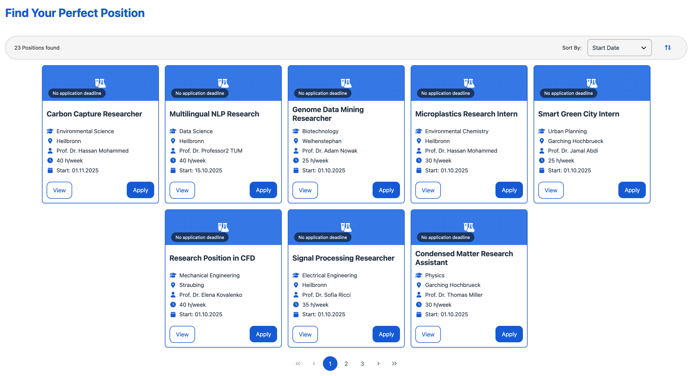
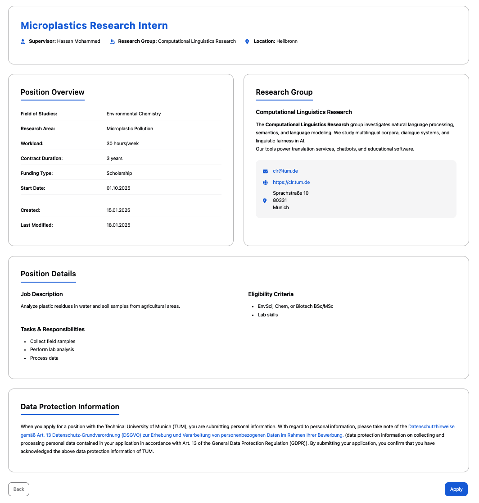

# Browse Positions

The **Find Positions** page enables doctoral applicants to explore available opportunities, evaluate position details, and submit applications through an intuitive interface designed for effective job matching.

---

## 🔍 Find Positions - Discovery Hub

This is the **primary entry point** for discovering doctorate opportunities.

- Displays available positions as organized **job cards** in a responsive grid layout
- Shows essential information at a glance: title, field of studies, location, supervisor, workload, and start date
- Features **timeline indicators** displaying the time remaining until the application deadline
- Includes **pagination controls** for browsing through extensive position listings
- Direct access to detailed information and application submission

  <em>Find Positions Page</em>

**Position Card Information:**
- **Relative Deadline**: Time left until application closes (e.g., "3 days left to apply")
- **Position Title**: Clear job descriptions (e.g., "EdTech Interface Designer", "Carbon Capture Researcher")
- **Field of Studies**: Academic discipline classification
- **Location**: TUM Campus Location (Garching, Heilbronn, Straubing)
- **Supervisor**: Professor who supervises the position
- **Workload**: Time commitment given in hours / week
- **Start Date**: Estimated Start Date of Position
---

## 📋 Job Details

Used for **in-depth evaluation** of individual positions before applying.

- Displays complete position information in a structured format
- Features **research group information** with contact details and website links
- Includes comprehensive **data protection information** for GDPR compliance
- Provides **direct application access** and easy navigation back to position browsing

  <em>Job Detail Page</em>

**Detailed Information Sections:**
- **Position Overview**: Field of studies, research area, workload, contract duration, funding type, start date, application deadline (if given), creation date and date of last modification
- **Research Group Details**: Short description, Contact information, website, physical address
- **Position Details**:
  - **Project Description**: Comprehensive description of the project
  - **Eligibility Criteria**: Qualifications and prerequisites for applicants
  - **Tasks & Responsibilities**: Tasks associated with the position
- **Data Protection**: GDPR compliance and privacy information

This module streamlines the position discovery and application process, enabling applicants to make informed decisions about their doctoral career opportunities before applying.

---

## ⚙️ Position Discovery Workflows

Below listed are the key workflows for browsing and applying to positions.

### 🔍 Workflow 1: Discovering Available Positions

**Goal:** Browse all available doctorate positions and identify opportunities of interest.

**Steps:**
1. Navigate to the **Find Positions** page from the main menu
2. Browse positions displayed as **job cards**
3. Use **pagination controls** to view additional positions
4. Note the *relative application deadlines* to prioritize opportunities that are near closing
5. Click **"View"** on any position card to access detailed information

**Video**: https://live.rbg.tum.de/w/artemisintro/61935

---

### 📖 Workflow 2: Evaluating Position Details

**Goal:** Thoroughly review position details, research group details, and application criteria.

**Steps:**
1. From any job card, click **"View"** to access the **Job Details Page**
2. Review **Position Overview** section
3. Examine **Research Group** details
4. Go through **Position Details**:
   - Comprehensive project description
   - Key tasks and responsibilities
   - Specific eligibility criteria
5. Review **Data Protection Information** for application privacy details
6. Use **"Back"** button to return to position browsing for comparison

**Video**: https://live.rbg.tum.de/w/artemisintro/61934

---

### 📝 Workflow 3: Applying for Positions

**Goal:** Submit applications for suitable positions with all required information.

**Steps:**
1. After reviewing position details on the **Job Details Page**
2. Ensure you meet all listed qualifications listed in the **Eligibility Criteria** section
3. Prepare necessary application materials (CV, recommendation letters, bachelor & master transcripts)
4. Click the **"Apply"** button to initiate the application process
5. Complete the application form with required information
