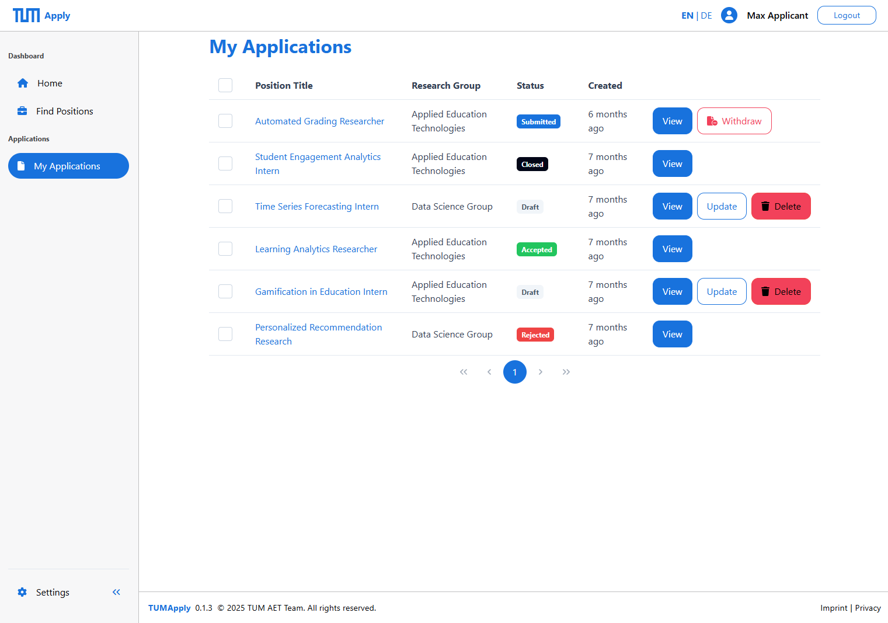

# Staying on Top of Your Applications: Your Personal Dashboard Guide

Welcome to your Application Overview page – your command center for managing all your doctoral applications at TUM! Think of this as your personal mission control where you can track, organize, and manage every application you've submitted or are working on. Whether you're applying to multiple positions or keeping tabs on a single dream opportunity, this dashboard keeps everything organized and accessible.

## Getting to Your Dashboard

Your Application Overview is your home base in the TUMApply system:

1. **From anywhere in the portal**: Click on "My Applications" in the main navigation
2. **After submitting an application**: You're automatically redirected here to see your updated status
3. **From the main dashboard**: Use the "Manage Applications" tile

## Understanding Your Application Overview Table

Each application appears as its own card, giving you a snapshot of the most important information at a glance:

### Application Status Indicators
- ⚪ **Draft**: Still working on it – you can continue editing anytime
- 🔵 **Submitted**: Application is complete and sent to the supervisor of the job to be reviewed
- 🟢 **Accepted**: Congratulations! You've been offered the position
- 🔴 **Rejected**: Unfortunately, this one didn't work out
- ⚫ **Withdrawn**: You've chosen to withdraw from this position
- ⚫ **Closed**: This job position was closed by the professor

### Key Information Displayed
- **Position title** (with a link to the Job Details)
- **Application state tag**
- **Created timestamp**
- **Action button bar** different actions that you can take with each application depending on the application state

## Taking Action on Your Applications

### For Draft Applications
Each draft application card offers several action buttons:

**Continue Editing**: Jump right back to where you left off in the application form
- Takes you to the exact page where you stopped
- All your previous work is automatically saved
- Progress stepper shows how much you've completed

**Preview Application**: See how your application looks before submitting
- Review all sections in a clean, formatted view
- Check that all required documents are uploaded
- Verify all information is correct

**Delete Draft**: Remove applications you no longer want to pursue
- Permanently removes the draft and all associated documents
- Useful for cleaning up your dashboard
- Cannot be undone once confirmed

### For Submitted Applications

**View Application Details**: See your complete submitted application
- Read-only view of everything you submitted
- Includes all uploaded documents
- Shows submission timestamp and confirmation details

**Track Progress**: Monitor where your application stands
- See status updates from supervisors
- Access any feedback or communications

**Withdraw Application**: Remove yourself from consideration
- Professional way to decline if you've accepted elsewhere
- Notifies supervisors immediately
- Cannot be undone once confirmed

## Pro Tips for Success

### Smart Application Management
1. **Check regularly**: Visit your dashboard at least weekly to catch updates
2. **Prioritize drafts**: Focus on applications with the nearest deadlines first
3. **Keep documents current**: Update your CV and transcripts across all applications if you get new achievements
4. **Set personal deadlines**: Submit applications a few days before the official deadline

### Organization Strategies
- **Monitor submission patterns**: Track when you submitted applications to plan follow-ups
- **Clean up regularly**: Delete draft applications you're no longer pursuing

## Understanding the Process

### Typical Application Journey
1. **Draft Creation**: Start your application and save progress
2. **Document Upload**: Add all required materials
3. **Review & Submit**: Final check and submission
4. **Initial Review**: Supervisor conducts preliminary evaluation
5. **Under Review**: Detailed evaluation of your application
6. **Decision Phase**: Interview invitation or final decision
7. **Outcome**: Acceptance, rejection, or waitlist status

### What Happens After Submission
- **Immediate confirmation**: System sends confirmation email
- **Supervisor notification**: Your application appears in their review queue
- **Status tracking**: Regular updates as your application progresses

Your Application Overview page is designed to reduce stress and keep you informed throughout the entire process. By staying organized and engaged with your dashboard, you'll never miss an important update or deadline. Remember, applying for doctoral positions is a journey – this dashboard is your trusted companion along the way!