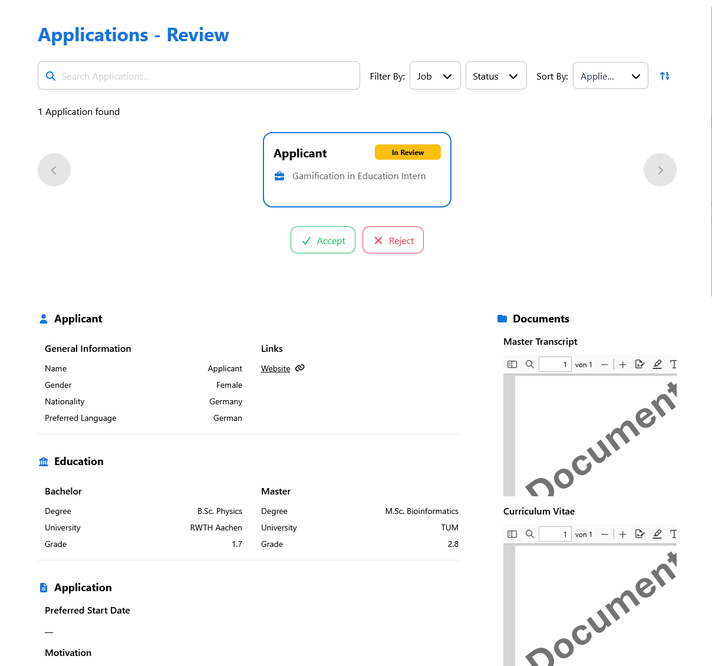
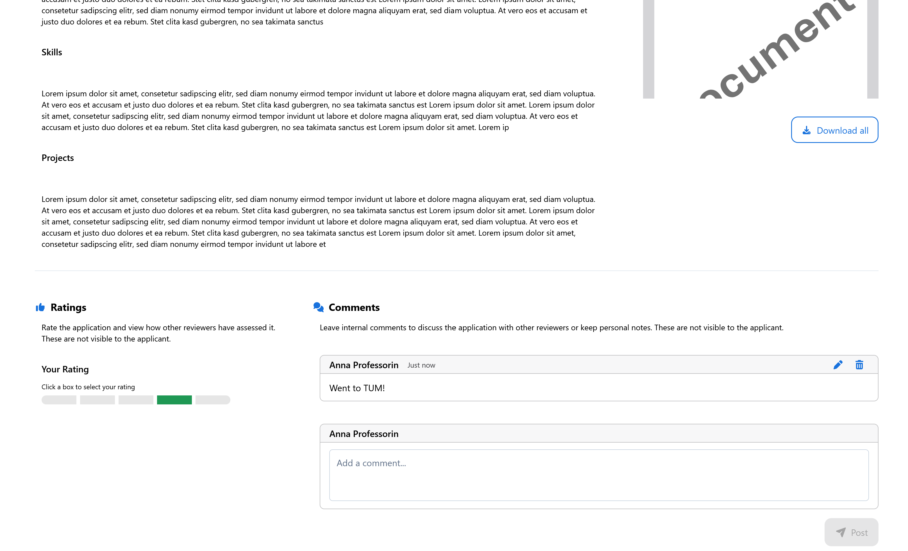

# Application Review

The **Applications Review** page provides comprehensive tools for professors to evaluate and manage applications for their published positions through an intuitive review interface.

---

## 📊 Application Overview - Review Dashboard

This is the **centralized evaluation interface** for all application management activities.

- **Application counter** displays total number of applications received for the position
- **Candidate card system** presenting each applicant with key information at a glance
- **Status indicators** showing current review state for each application
- **Quick action buttons** for immediate accept/reject decisions without detailed review

  <em>Applications Review Dashboard</em>

**Application Status System:**
- 🟡 **In Review**: Applications currently under evaluation by the professor
- 🟢 **Accepted**: Applications that have been approved and candidates notified
- 🔴 **Rejected**: Applications that have been declined with automatic candidate notification

**Candidate Information Cards:**
- **Applicant Name**: Full name display with clear identification
- **Application Position**: Title of the doctorate position applied for
- **Status Badge**: Current evaluation state with color-coded visual indicators
- **Quick Actions**: Direct accept/reject buttons for efficient decision-making

---

## 🔍 Detailed Application Review

Used for **comprehensive candidate evaluation** with complete application materials and detailed assessment capabilities.

- **Structured information layout** presenting candidate data in organized sections
- **Document viewer system** for reviewing uploaded materials including CVs, transcripts, and reference letters
- **Educational background display** with academic credentials and grading information
- **Application-specific details** including motivation letters and project preferences

**Comprehensive Review Sections:**
- **Personal Information**: Contact details, nationality, and language preferences
- **Educational Background**: Academic qualifications with institution details and grades
- **Application Materials**: Motivation letters, skills assessment, and project descriptions
- **Supporting Documents**: CV, academic transcripts, reference letters, and certificates

**Document Management Features:**
- **Integrated PDF viewer** for seamless document review without external applications
- **Download functionality** allowing professors to save documents for offline review
- **Document categorization** with clear labels for easy identification
- **Multi-document support** enabling review of complete application packages

---

## ⚙️ Steps for Application Review

This document outlines key steps for evaluating and managing applications through the review system.

### 📌 Prerequisites

- Professor account access with review permissions for published positions
- Active positions that have received applications from candidates

### 📊 Step 1: Accessing Application Review Dashboard

**Goal:** Navigate to the centralized application review interface to begin candidate evaluation.

**Steps:**
1. Navigate to **"My Positions"** from the sidebar menu
2. **Locate positions with applications** by checking the application counter or status indicators
3. **Access the review interface** by clicking on positions that show received applications
4. **Review the application overview** displaying:
  - Total number of applications received for the position
  - Candidate cards with essential information summary
  - Current status indicators for each application
  - Quick action buttons for immediate decisions

### 🔍 Step 2: Detailed Application Evaluation

**Goal:** Conduct thorough review of individual applications with complete candidate materials.

**Steps:**
1. **Select a candidate** from the application dashboard to access detailed review
2. **Review candidate information systematically**:
  - **General Information**: Name, contact details, nationality, and language preferences
  - **Educational Background**: Academic degrees, institutions, and grades
  - **Application Details**: Preferred start dates, motivation, and skills assessment
3. **Examine supporting documents**:
  - **Curriculum Vitae**: Professional and academic background
  - **Academic Transcripts**: Grade records and academic performance
  - **Reference Letters**: Professional recommendations and endorsements
  - **Additional Certificates**: Supplementary qualifications and achievements
4. **Utilize document viewer tools**:
  - View documents directly within the platform interface
  - Download documents for detailed offline review
  - Navigate between multiple documents efficiently

### ✅ Step 3: Making Application Decisions

**Goal:** Render final decisions on applications and notify candidates of outcomes.

**Steps:**
1. **From the detailed review page**:
  - **Accept qualified candidates** using the green **"Accept"** button
  - **Reject unsuitable applications** using the red **"Reject"** button
2. **From the dashboard overview**:
  - Use quick action buttons for efficient bulk decision-making
  - Review status changes reflected immediately in the interface
3. **Understand decision consequences**:
  - **Accepted candidates** receive automatic notification with next steps
  - **Rejected candidates** receive polite notification of decision
  - **Status updates** are reflected across all management interfaces

### 📋 Step 4: Application Management Best Practices

**Goal:** Maintain efficient and fair evaluation processes throughout the review period.

**Steps:**
1. **Regular review sessions**:
  - Check for new applications periodically
  - Maintain consistent evaluation criteria across all candidates
  - Document decision rationale for institutional records
2. **Efficient workflow management**:
  - Use quick actions for clear accept/reject decisions
  - Reserve detailed review for borderline cases requiring thorough evaluation
  - Monitor application deadlines and review timelines
3. **Communication considerations**:
  - Respond to applications within reasonable timeframes
  - Maintain professional standards in all candidate interactions
  - Coordinate with institutional policies for application processing

This comprehensive review system enables fair and efficient candidate evaluation while maintaining professional standards and institutional compliance.
