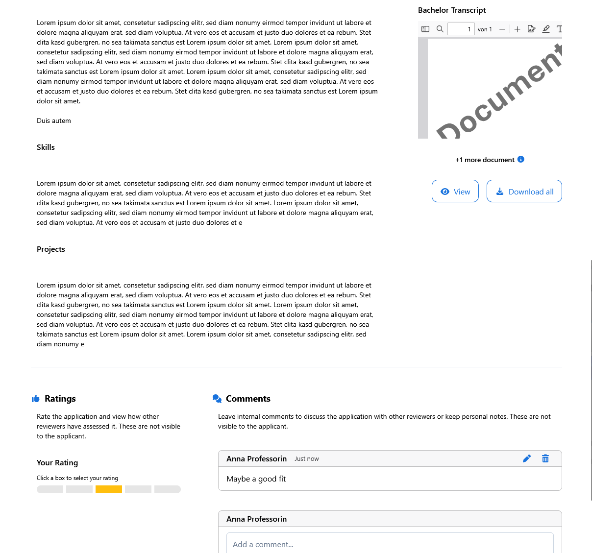

# Application Review

The **Applications - Review** page is your workspace for reviewing and managing applications. It provides a structured overview, inline access to documents, and simple tools for recording ratings, comments, and decisions.

---

## ⚙️ Features

* **Overview dashboard**: See all applications for your open positions, with color-coded status labels.
* **Inline document viewer**: Open CVs, transcripts, and other documents directly in the browser without downloads.
* **Structured details**: Applicant information (education, background, motivation) is presented in a clear, comparable layout.
* **Ratings and comments**: Record your own evaluations and view input from colleagues in your research group.

  * Ratings are selected from: **Poor, Fair, Satisfactory, Good, Excellent**.
  * Ratings and comments are **internal only** — applicants never see them.
* **Carousel navigation**: Move quickly between applications without returning to the overview.
* **Decision dialogs**: Accept or reject applicants through a guided dialog that confirms your choice and prepares communication.
* **Email notifications**: Send multilingual acceptance or rejection messages with customizable templates.
* **Filtering and sorting**: Focus on applications by status, rating, or submission date.
* **Documents download**: Download a ZIP containing all documents for an application.

---

## ⚠️ Application Status System

* ⚪ **Unopened**: Submitted but not yet opened.
* 🟡 **In Review**: Currently being evaluated.
* 🟢 **Accepted**: Approved; candidate has been notified.
* 🔴 **Rejected**: Declined; candidate has been notified.

---

## 📄 Documents

On the review page, you will see a preview of the most relevant documents (e.g., CV, transcripts) directly inline. This makes it easy to assess candidates without leaving the page.

If you want to view all submitted documents in full size, click the **_View_** button in the document section. A dedicated document viewer will open, allowing you to navigate through every file submitted by the applicant.

For offline access or sharing within your group, use the **_Download All_** button. This will create a ZIP archive containing all documents submitted with the application.

---

## ⚙️ Steps for Reviewing an Application

Follow these steps to evaluate and manage applications.

### 📌 Prerequisites

* You are logged in to TUMApply.
* You belong to a research group or have permissions to access the position.
* At least one candidate has submitted an application.

### 🧭 How to Get There

There are two ways to access the **Applications - Review** page:

1. **From the Applications Overview page**

   Click the **More** button on a candidate’s application entry and select **Review**.
   

2. **From the sidebar navigation**

   Open the sidebar and select **Applications → Review**.

---

### ▶️ Step-by-Step

1. **Open the Applications Overview Page**

   Go to the *Review* tab. You’ll see all applications for your positions.

2. **Select a candidate**

   Click on an application to open the detailed review view.

3. **Inspect documents**

   Use the inline viewer to read submitted files (CV, transcripts, letters). For full access, click *View All* or *Download All*.

4. **Review applicant profile**

   Look at structured data — education, previous experience, and motivation statements.

5. **Provide a rating**

   Choose from the rating scale: **Poor, Fair, Satisfactory, Good, Excellent**.
   *(Note: Ratings are only visible to your research group, not to the applicant.)*

6. **Leave comments**

   Add qualitative feedback or observations.
   *(Comments are also internal and not shared with applicants.)*

7. **Decide**

   Use the *Accept* or *Reject* buttons under the carousel. A confirmation dialog will appear.

  * If you accept, you can optionally close the position and notify the applicant.
  * If you reject, select a reason and confirm.

8. **Notify the applicant**

   The dialog includes a *Notify Applicant* checkbox (pre-checked). You may uncheck if you wish to send a message later or externally.

9. **Continue with next applications**

   Use the carousel to move to the next candidate seamlessly.

10. **Track status changes**

    After decisions, application statuses update automatically (e.g. “In Review” → “Accepted” or “Rejected”).

### 🎥 Help Video

For a visual walkthrough of the review workflow, check out this video:
[How to review an application](https://www.youtube.com/watch?v=5bqUYhrwyK0)

---

> **💡 Tip:** Keep your browser window wide enough to show details, documents, and the rating panel side by side — this reduces scrolling and speeds up your review workflow.
