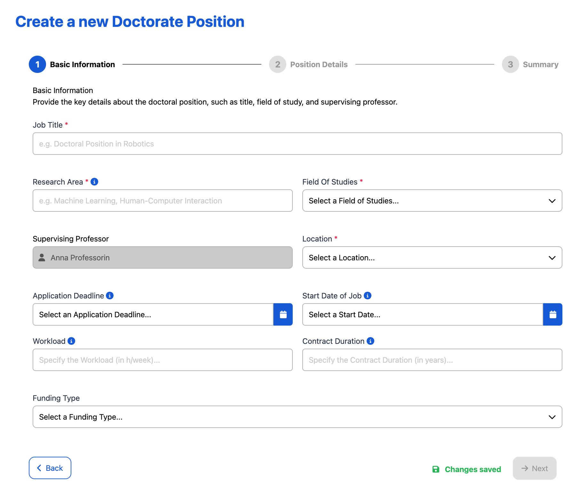
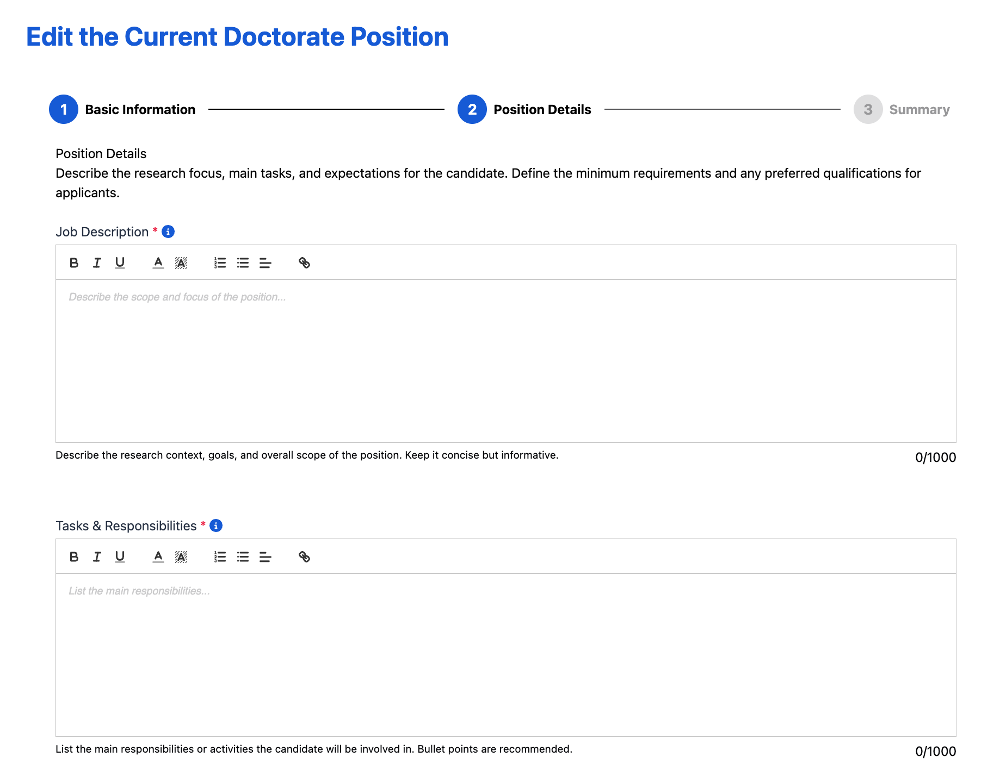
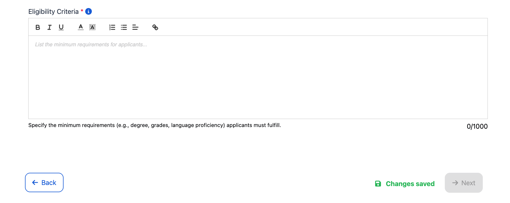
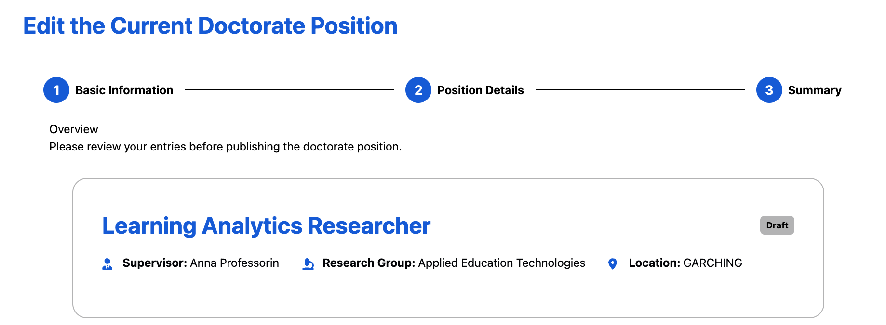
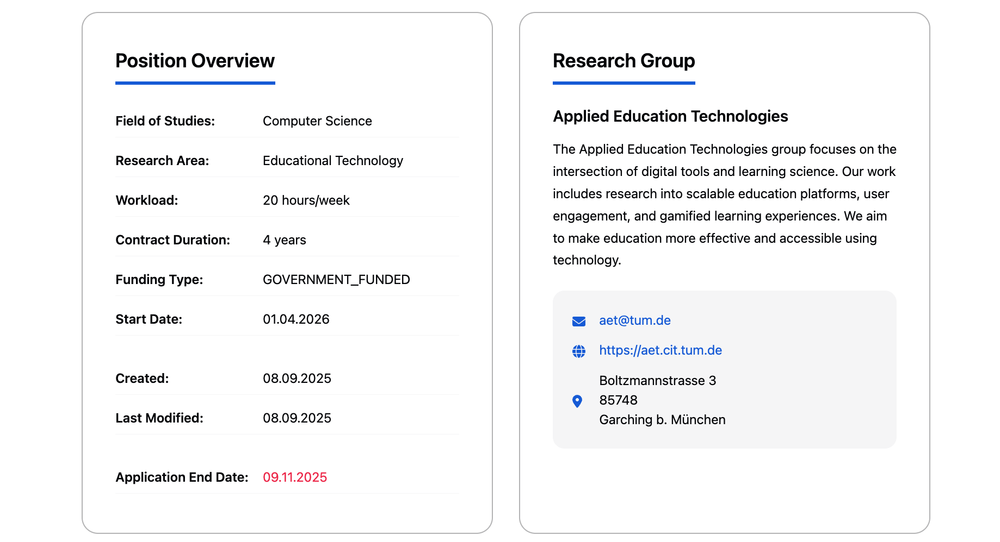
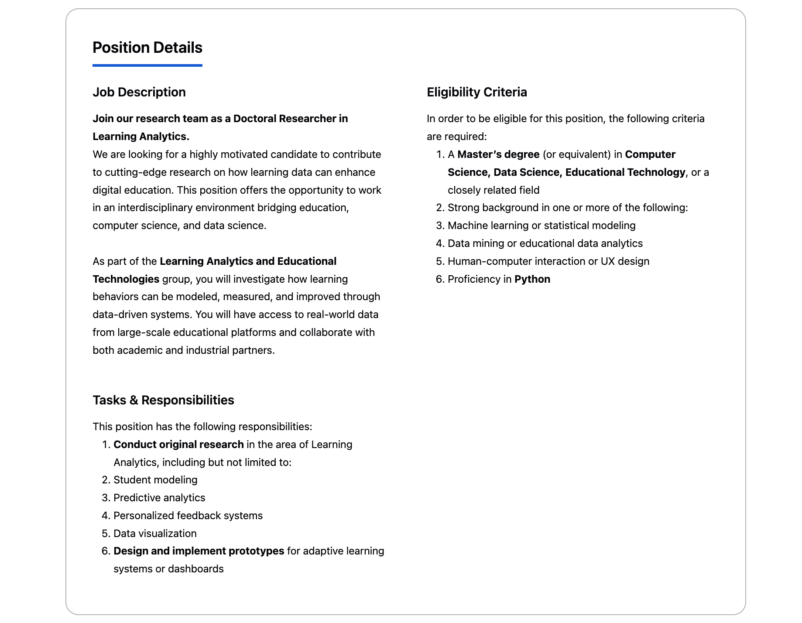
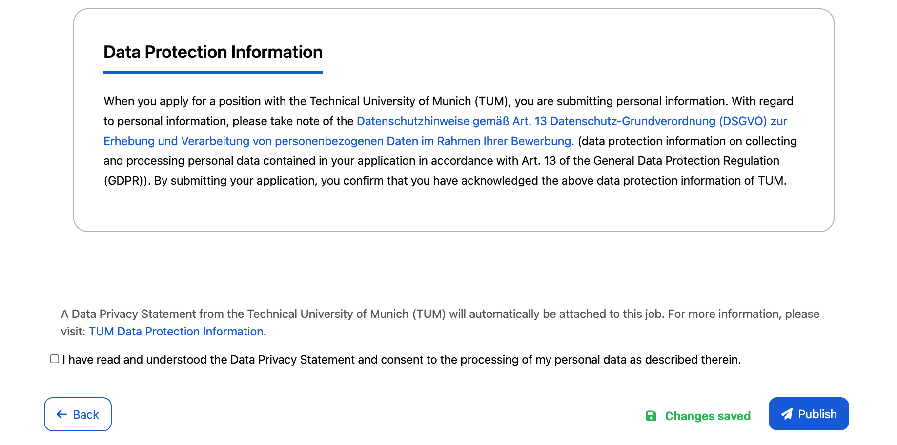

# Create Positions

The **Job Creation Form** provides comprehensive tools for professors to develop compelling doctorate position listings through a structured, multi-step process that ensures all essential information is captured effectively.

---

## 📝 Position Creation - Multi-Step Form

This is the **comprehensive creation interface** for developing new doctorate positions.

- **Step-by-step wizard** guiding through all required sections with clear navigation
- **Auto-save functionality** to prevent data loss during the creation process
- **Form validation system** with real-time error checking and required field indicators
- **Draft saving capability** allowing positions to be completed over multiple sessions

### Step 1: Basic Information

  <em>Job Creation Form Step 1: Basic Information</em>

**Step 1: Basic Information**
- **Required Fields** (marked with red asterisks): Job Title, Research Area, Field of Studies, Location
- **Supervising Professor**: Auto-filled with currently logged-in user's details
- **Timeline Configuration**: Application Deadline, Job Start date, workload in hours / week (up to 40 hours / week), contract duration in years (up to 6 years)
- **Validation System**: Users can **only** navigate to the next step using the **"Next"** button after completing all required fields

### Step 2: Position Details

  <em>Job Creation Form Step 2: Position Details</em>

**Step 2: Position Details**
- **Job Description**: Rich-text editor for comprehensive research project explanation
- **Eligibility Criteria**: Academic qualifications, skills, and experience prerequisites
- **Tasks & Responsibilities**: Detailed breakdown of expected duties and activities
- **Formatting Tools**: Advanced text editing capabilities for professional presentation

### Step 3: Review Job Details

  <em>Job Creation Form Step 3: Review</em>

**Step 3: Review Job Details**
- **Final Review**: Comprehensive preview of complete position before publication
- **Data Protection Compliance**: Mandatory checkbox for Data Privacy Terms agreement
- **Publication Options**: Option to publish immediately using **"Publish"** button or press **"Back"** to edit any mistakes

This creation system ensures comprehensive position development while maintaining institutional standards and regulatory compliance.

---

## ⚙️ Steps for Creating Jobs

This document outlines key steps for creating and publishing doctorate positions.

### 📌 Prerequisites

- All steps require professor account access with position creation permissions

### 📝 Step 1: Creating New Positions from Scratch

**Goal:** Develop comprehensive position listings with all required information through the structured creation process.

**Steps:**
1. Navigate to **"Create Position"** from the sidebar menu
2. **Complete Step 1 - Basic Information**:
   - Enter all required fields marked with red asterisks
   - Enter any optional fields as needed
3. **Complete Step 2 - Position Details**:
   - Write comprehensive project description using the rich-text editor
   - Define specific key tasks and responsibilities expected of the candidate
   - List detailed eligibility criteria including academic qualifications and preferred skills
   - Use formatting tools to enhance readability and professional presentation
4. **Complete Step 3 - Review Job Details**:
   - Preview the complete position as it will appear to applicants
   - Confirm mandatory data privacy terms and conditions
   - Make any necessary edits by navigating back to previous steps
5. **Finalize the position**:
   - Either publish immediately using the **"Publish"** button or leave the form and the position will be saved as a draft for later completion
   - Positions that are saved as drafts are not visible to applicants

**Video**: https://live.rbg.tum.de/w/artemisintro/61937
