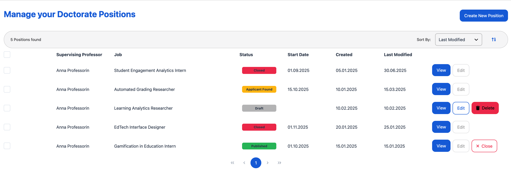
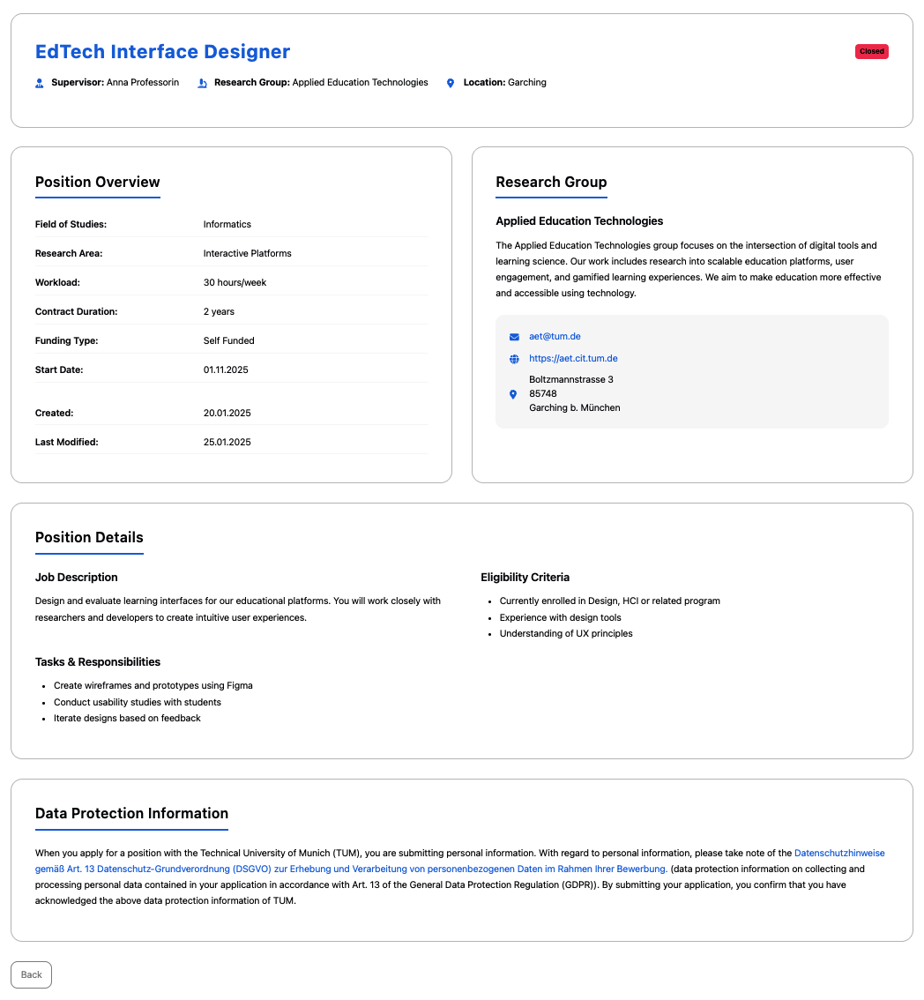

# Manage Positions

The **My Positions** page provides comprehensive tools for professors to oversee and manage all their created doctorate positions through a centralized dashboard.

---

## 📋 My Positions - Management Dashboard

This is the **central command center** for all position management activities.

- Displays all positions in a **structured table format** with comprehensive status tracking and timeline information
- Features **dynamic action buttons** that adapt based on current position state and lifecycle stage
- Shows **visual status indicators** with color-coded badges for instant assessment of position states

  <em>My Positions Dashboard</em>

**Comprehensive Status System:**
- 🟢 **Published**: Live positions actively accepting applications from qualified candidates
- 🟠 **Applicant Found**: Suitable candidate has been identified, position is no longer actively recruiting
- 🔴 **Closed**: Position no longer accepting applications, all applicants have been notified
- ⚫ **Draft**: Position in development phase, not yet visible to applicants

**Context-Sensitive Action Controls:**
- **View**: Access complete position details and current status (available for all positions regardless of state)
- **Edit**: Modify position specifications, requirements, and details (draft positions only)
- **Delete**: Permanently remove positions that haven't been published (draft positions only)
- **Close**: End application acceptance period and automatically reject all unreviewed applications and notify all applicants (published positions only)

---

## 🔍 Position Details

Used for **comprehensive position review** with full management capabilities and administrative controls.

- Shows **current position status** prominently displayed with clear visual indicators
- Provides **enhanced information display** including all details visible to applicants
- Features **status-dependent action buttons** matching capabilities available in the dashboard interface
- Includes **administrative context** and editing access not available in the applicant view

  <em>Job Detail Page</em>

**Enhanced Management Features:**
- **Status Display**: Current position state with timestamp information
- **Management Actions**: Context-appropriate controls for position lifecycle management
- **Administrative Details**: Creation date and last modification date are displayed for oversight
- **Applicant Perspective Toggle**: View position as it appears to potential candidates

---

## ✏️ Position Editing - Refinement Interface

**Comprehensive editing system** for updating and improving unpublished positions.

- **Pre-filled forms** containing all previously saved information for efficient updating
- **Multi-step editing process** matching the creation workflow for consistency

This integrated management system enables efficient oversight of the complete position lifecycle from creation through successful candidate placement.

---

## ⚙️ Position Management Workflows

This document outlines key workflows supported by the position management dashboard.

---

### 📌 Prerequisites

- All workflows require professor account access
- Position management capabilities vary based on current position status

---

### 📊 Workflow 1: My Positions Dashboard Overview

**Goal:** Access and navigate the centralized management dashboard to monitor all your positions.

**Steps:**
1. Navigate to **"My Positions"** from the sidebar menu
2. **Review the position table** displaying all your created positions with:
  - Position titles and supervising professor name
  - Current status with color-coded visual indicators
  - Estimated start date of position
  - Creation dates and last modification timestamps
  - Context-sensitive action buttons
3. **Use the status indicators** to quickly assess position states:
  - Draft positions needing completion or publication
  - Published positions accepting applications
  - Positions that have found a suitable applicant
  - Closed positions that were previously published
4. **Access quick actions** directly from the table:
  - Click **"View"** to see detailed position information
  - Use **"Edit"** for draft positions needing updates
  - Select **"Delete"** to remove unwanted draft positions
  - Choose **"Close"** to reject all applications for published positions

**Video**: https://live.rbg.tum.de/w/artemisintro/61932

---

### 🔍 Workflow 2: Viewing Job Details

**Goal:** Access comprehensive position information with professor management capabilities.

**Steps:**
1. From the **My Positions** dashboard, click **"View"** on any position
2. **Review the enhanced position details** including:
  - Current status prominently displayed at the top
  - Complete position information as seen by applicants
  - Administrative details like creation and modification dates
  - Research group information and contact details
3. **Access management controls** directly from the detail page:
  - Status-appropriate action buttons based on current position state
  - Quick navigation back to the previous page
  - Direct access to editing functionality for draft positions

**Video**: https://live.rbg.tum.de/w/artemisintro/61933

---

### ✏️ Workflow 3: Editing and Updating Existing Positions

**Goal:** Modify position details to improve clarity, update requirements, or reflect changed circumstances.

**Steps:**
1. From the dashboard or position details page, click **"Edit"** to access the **Position Editing Interface**
2. **Navigate pre-filled editing forms** containing all current position information:
  - Step through the same multi-step process used in the job creation form
  - Review each section systematically for needed updates
  - Utilize auto-save functionality to preserve changes during editing
3. **Finalize updates**:
  - Review all changes in the final step
  - Either publish immediately using the **"Publish"** button or leave the form and the position will be saved as a draft for later completion

**Video**: https://live.rbg.tum.de/w/artemisintro/61936

---

### 🔒 Workflow 4: Closing and Deleting Positions

**Goal:** Properly manage position lifecycle endpoints through closure or deletion.

**Steps:**
1. **For Published Position Closure**:
  - From dashboard or position details, click **"Close"** on published positions
  - **Confirm closure understanding** that the position will:
    - Change status from "Published" to "Closed"
    - Automatically reject all unreviewed applications
    - Send notifications to all applicants about position closure
  - **Authorize the closure** knowing that no further applications will be accepted
  - **Verify status change** is reflected in the dashboard with updated badges

2. **For Draft Position Deletion**:
  - From dashboard or position details, click **"Delete"** on draft positions
  - **Review deletion implications** understanding that:
    - The position will be permanently removed from the system
    - All draft content will be lost and cannot be recovered
    - This action is irreversible once confirmed
  - **Confirm deletion** only after ensuring valuable content is preserved elsewhere if needed
  - **Verify removal** from the dashboard table

**Video**: https://live.rbg.tum.de/w/artemisintro/61938
