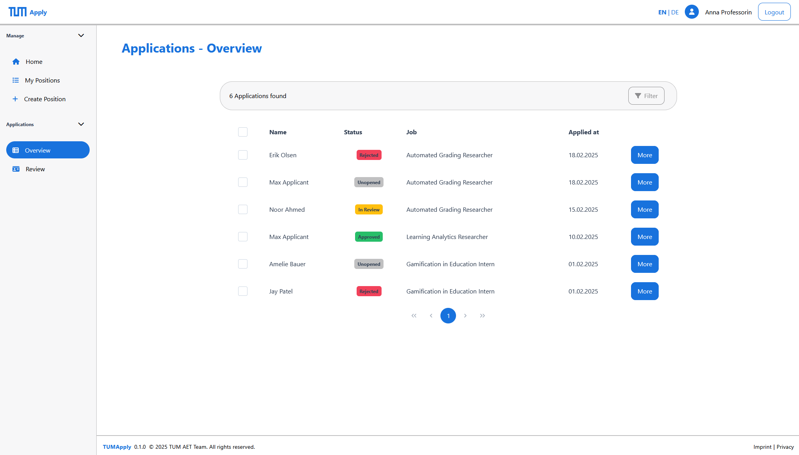
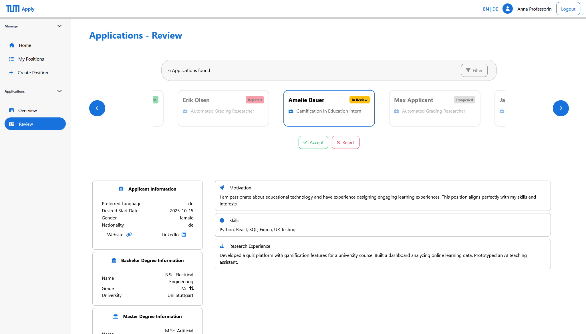

# 🧠 Evaluation Module

The **Evaluation Module** is designed to support professors in reviewing and managing applications submitted to their job postings. It provides a structured workflow for evaluating candidates, leaving feedback, and making decisions.

---

## 🖥️ Applications - Overview Page

This is the **entry point** for the evaluation process.

- Displays a table of all applications for the professor’s research group.
- Includes a dynamic **filter bar** to narrow down results by job, state, and other attributes.
- Supports sorting and pagination for large datasets.
- Clicking on an entry opens the **Review Page** for detailed inspection.

---

## 🔍 Applications - Review Page

Used for **in-depth evaluation** of individual applications.

- Shows complete applicant information, including documents, motivation, etc.
- Allows professors to **accept** (with a message) or **reject** (with a predefined reason) the application.
- Features a **carousel** for navigating between filtered applications without returning to the table.

---

This module streamlines the evaluation workflow, enabling efficient and consistent review of applications.
