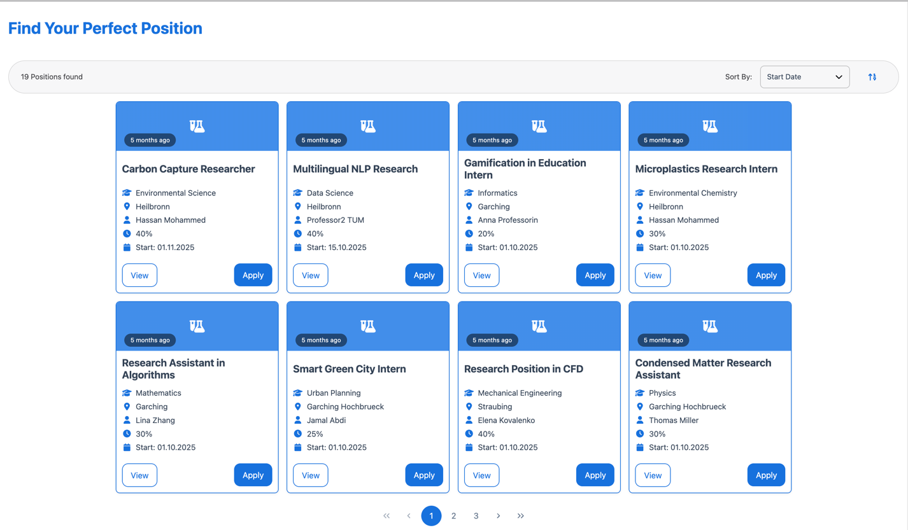
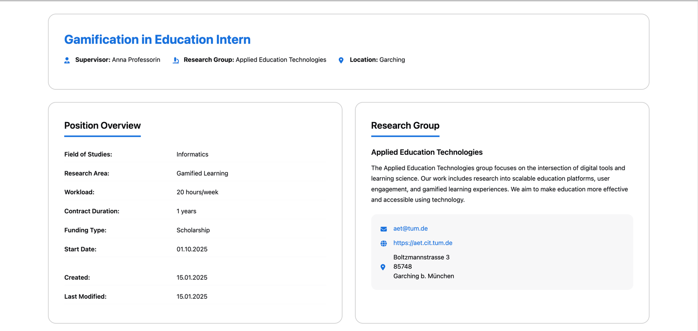
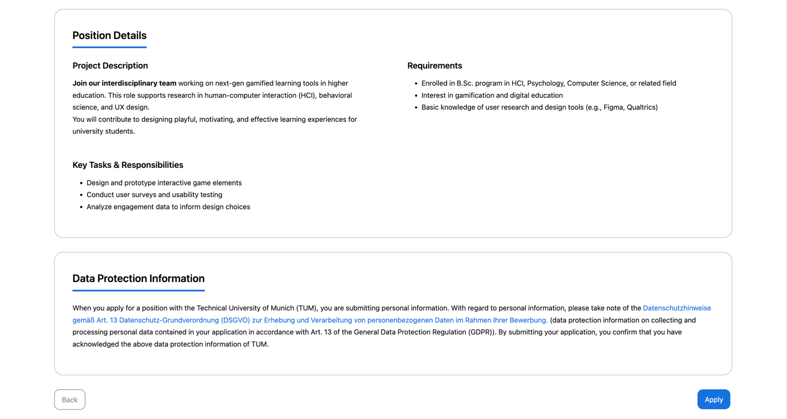
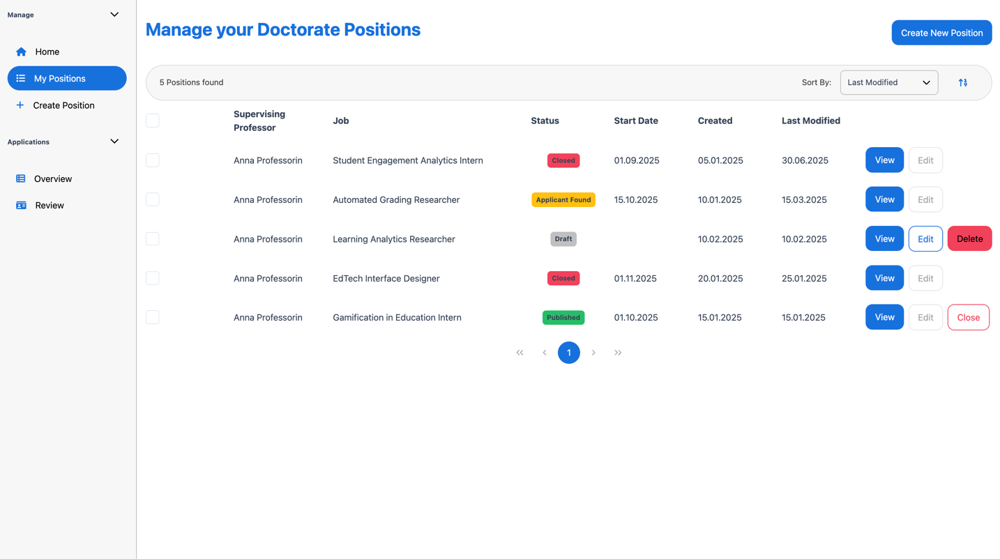
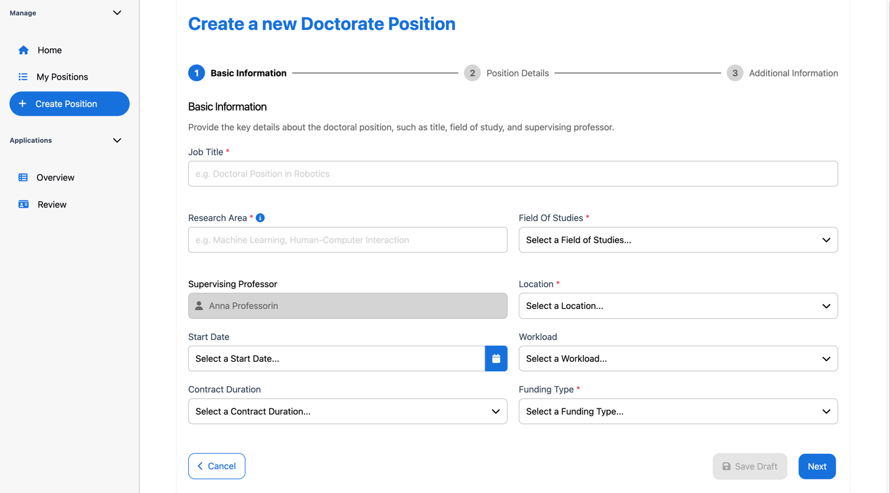
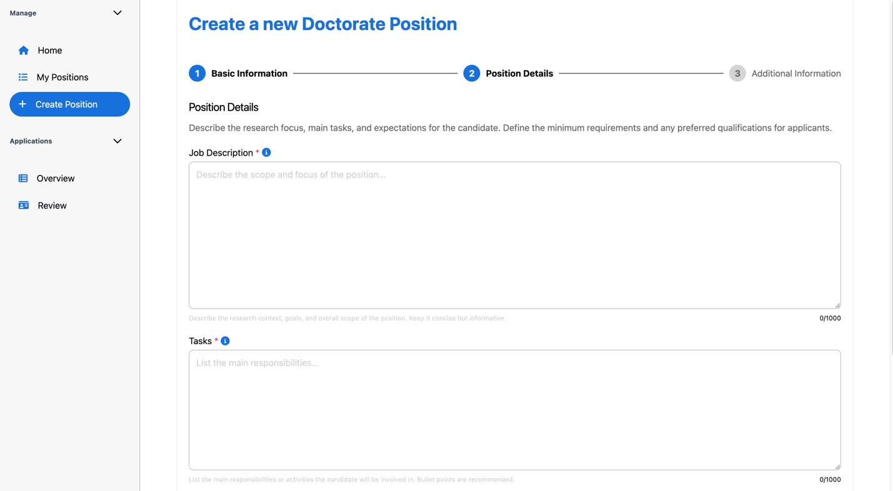
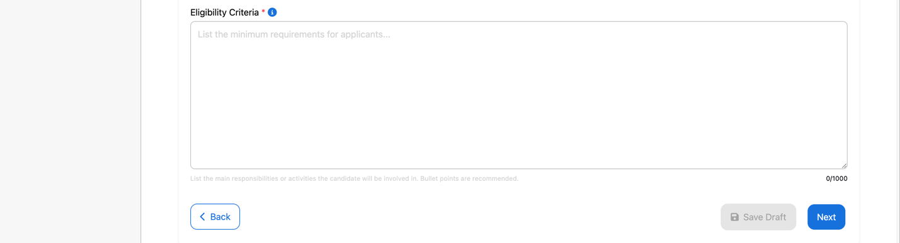
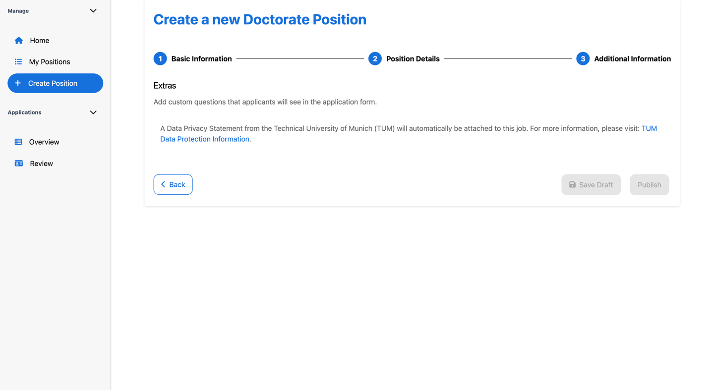
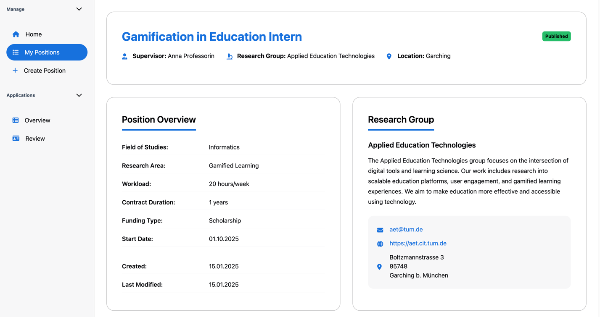
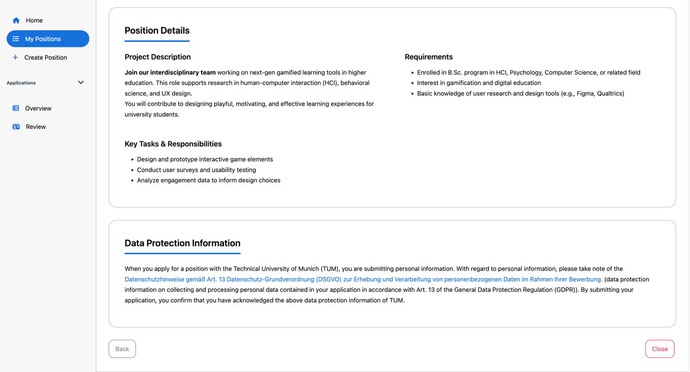

# Doctorate Application Website Documentation

## Table of Contents

1. [Overview](#1-overview)
2. [Applicant Features](#2-applicant-features)

- 2.1 [Find Positions Page](#21-find-positions-page)
- 2.2 [Job Detail Page](#22-job-detail-page)

3. [Professor Features](#3-professor-features)

- 3.1 [Position Management Dashboard](#31-position-management-dashboard)
- 3.2 [Position Creation Form](#32-position-creation-form)
- 3.3 [Job Detail Page (Professor View)](#33-job-detail-page-professor-view)

---

## 1. Overview

This documentation covers the key features and user flows for the job module of the TUMApply website, designed to connect professors with potential doctoral candidates. The platform provides two main user perspectives: **applicants** seeking positions and **professors** creating and managing job postings.

The system supports a complete lifecycle from position creation to position management, with distinct interfaces optimized for each user type.

---

## 2. Applicant Features

### 2.1 Find Positions Page

#### 2.1.1 Purpose

The **Find Positions** page serves as the main discovery hub where applicants can browse available doctorate positions across various fields and institutions.

#### 2.1.2 Position Cards Display

Positions are displayed as organized cards in a responsive grid layout. Each card contains:

- **Position Title**: Clear job titles (e.g., "EdTech Interface Designer", "Carbon Capture Researcher")
- **Field of Study**: Academic discipline (Informatics, Environmental Science, Data Science, etc.)
- **Location**: Geographic location (Garching, Heilbronn, Straubing, etc.)
- **Supervisor Name**: Responsible faculty member (Stephan Krusche, etc.)
- **Workload Percentage**: Time commitment (20%, 30%, 40%, etc.)
- **Start Date**: Position commencement date (01.11.2025, 15.10.2025, etc.)
- **Posted Timeline**: Time since publication ("5 months ago")

#### 2.1.3 Interactive Elements

- **View Button**: Access detailed position information
- **Apply Button**: Direct application submission for interested candidates
- **Pagination Controls**: Navigate through multiple pages of positions

### 2.2 Job Detail Page

#### 2.2.1 Purpose

Provides comprehensive information about a specific doctorate position to help applicants make informed decisions before applying.

#### 2.2.2 Position Overview Section

Contains essential position details:

- **Field of Studies**: Academic discipline classification
- **Research Area**: Specific focus area within the field
- **Workload**: Time commitment requirements (in hours/week)
- **Contract Duration**: Employment period specifications (in years)
- **Funding Type**: Financial support classification (Research Grant, etc.)
- **Start Date**: Position commencement timeline
- **Creation Date**: When position was first posted
- **Last Modified**: Most recent update timestamp

#### 2.2.3 Research Group Information

Displays comprehensive contact and organizational details:

- **Research Group**: Name of the academic research team or lab offering the position (e.g., Applied Education Technologies)
- **Contact Email**: Direct communication channel (e.g. aet@tum.de)
- **Website**: Research group web presence (e.g. https://aet.cit.tum.de)
- **Physical Address**:
  - Street address (e.g. Boltzmannstrasse 3)
  - Postal code and city (e.g. 85748 Garching b. München)

#### 2.2.4 Position Details Section

Provides specific job information:

- **Project Description**: Detailed explanation of research project
- **Key Tasks & Responsibilities**: Expected duties and activities
- **Requirements**: Qualifications and prerequisites for applicants

#### 2.2.5 Data Protection Information

Comprehensive GDPR compliance section including:

- **Privacy Notice**: Data collection and processing explanation
- **Legal Framework**: Reference to Art. 13 DSGVO (General Data Protection Regulation)
- **Consent Information**: Clear explanation of data usage rights

#### 2.2.6 Navigation Controls

- **Back Button**: Return to previous page
- **Apply Button**: Initiate application process

---

## 3. Professor Features

### 3.1 Position Management Dashboard

#### 3.1.1 Purpose

Central management hub where professors can oversee all their posted doctorate positions with comprehensive status tracking and action capabilities.

#### 3.1.2 Position Management Table Structure

The dashboard displays positions in a structured table format with the following columns:

- **Selection Checkbox**: Bulk selection for multiple positions
- **Supervising Professor**: Faculty member responsible for the position
- **Job Title**: Position name
- **Status**: Current position state with visual indicators
- **Start Date**: Position commencement timeline
- **Created**: Position creation timestamp
- **Last Modified**: Most recent update timestamp
- **Actions**: Context-sensitive management buttons

#### 3.1.3 Status Types and Visual Indicators

##### Closed Status

- **Visual Indicator**: Red badge with "Closed" text
- **Meaning**: Position is no longer accepting applications

##### Applicant Found Status

- **Visual Indicator**: Orange badge with "Applicant Found" text
- **Meaning**: Suitable candidate has been identified

##### Published Status

- **Visual Indicator**: Green badge with "Published" text
- **Meaning**: Position is live and accepting applications

##### Draft Status

- **Visual Indicator**: Gray badge with "Draft" text
- **Meaning**: Position is being prepared but not yet published

#### 3.1.4 Dynamic Action Buttons

##### View Button

- **Availability**: All positions regardless of status
- **Function**: Access detailed position information

##### Edit Button

- **Availability**: All positions regardless of status
- **Function**: Modify position details and specifications

##### Delete Button

- **Availability**: Draft positions only
- **Function**: Remove unpublished positions from the system

##### Close Button

- **Availability**: Published positions only
- **Function**: End application acceptance and notify all applicants
- **Process**: Automatically sends notifications to all applicants about position closure

### 3.2 Position Creation Form

#### 3.2.1 Purpose

Comprehensive multi-step form allowing professors to create detailed doctorate position postings with all necessary information for potential applicants.

#### 3.2.2 Step 1: Basic Information

##### Required Fields

- **Job Title**:

  - Input type: Text field
  - Validation: Required field (indicated by red asterisk)

- **Field of Studies**:

  - Input type: Dropdown selection
  - Validation: Required field

- **Location**:

  - Input type: Dropdown selection
  - Validation: Required field

- **Funding Type**:
  - Input type: Dropdown selection
  - Validation: Required field

##### Research Details

- **Research Area**:

  - Input type: Text field
  - Validation: Optional field with informational tooltip

- **Supervising Professor**:
  - Input type: Pre-populated field
  - Status: Non-editable

##### Timeline and Workload

- **Start Date**:

  - Input type: Date picker

- **Workload**:

  - Input type: Dropdown selection
  - Values: in percentage (%)

- **Contract Duration**:
  - Input type: Dropdown selection
  - Values: in years

##### Form Controls

- **Cancel Button**: Return to previous page
- **Next Button**: Continue to position details step

#### 3.2.3 Step 2: Position Details

Multi-section form for detailed position information including project description, key tasks, and requirements.

#### 3.2.4 Step 3: Additional Information

Final step containing data protection information and additional terms applicable to all positions.

### 3.3 Job Detail Page (Professor View)

#### 3.3.1 Purpose

Provides professors with a comprehensive view of their position details, including status indicators and management capabilities not available to applicants.

#### 3.3.2 Status Display

- **Current Status**: Prominently displayed in the top-right corner
- **Visual Design**: Matches status indicators from the management dashboard
- **Dynamic Updates**: Changes based on position lifecycle

#### 3.3.3 Status-Dependent Actions

The available actions mirror those from the "My Positions" dashboard:

- **Draft Positions**: Edit and Delete options available
- **Published Positions**: View and Close options available
- **Closed Positions**: View-only access
- **Applicant Found Status**: View-only access

#### 3.3.4 Enhanced Information Display

Contains the same comprehensive information as the applicant view, but with additional management context and editing capabilities for the position owner.

---
